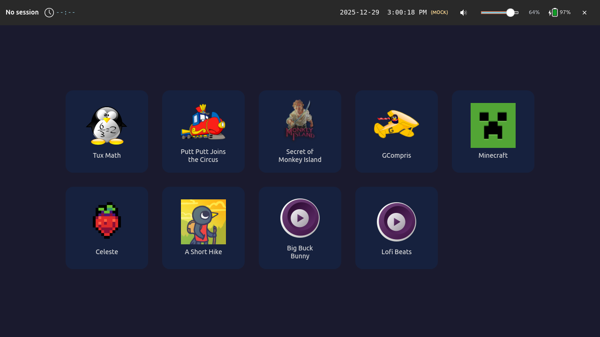
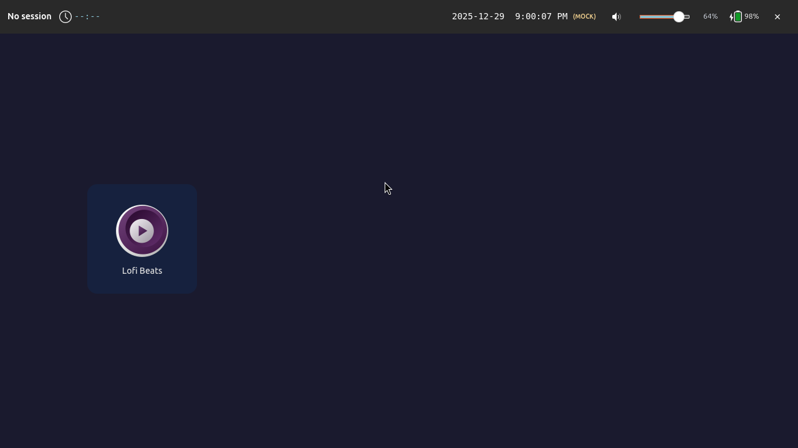
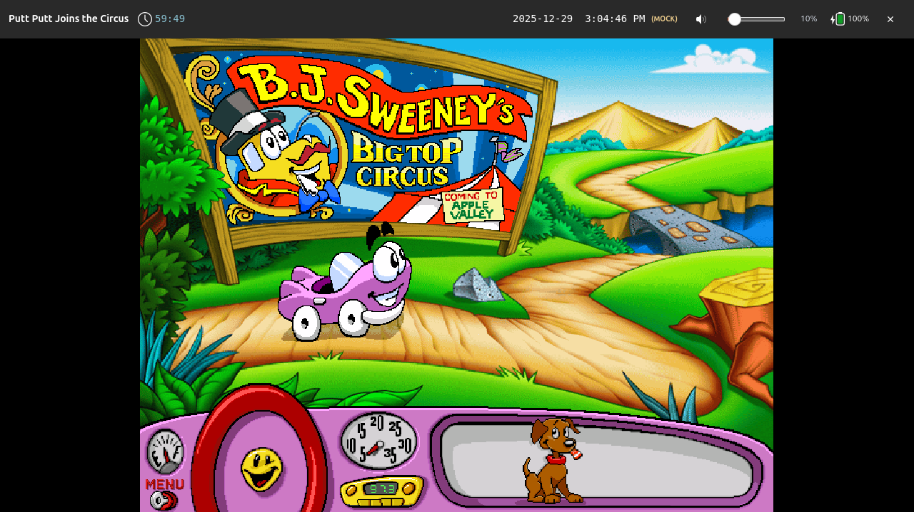
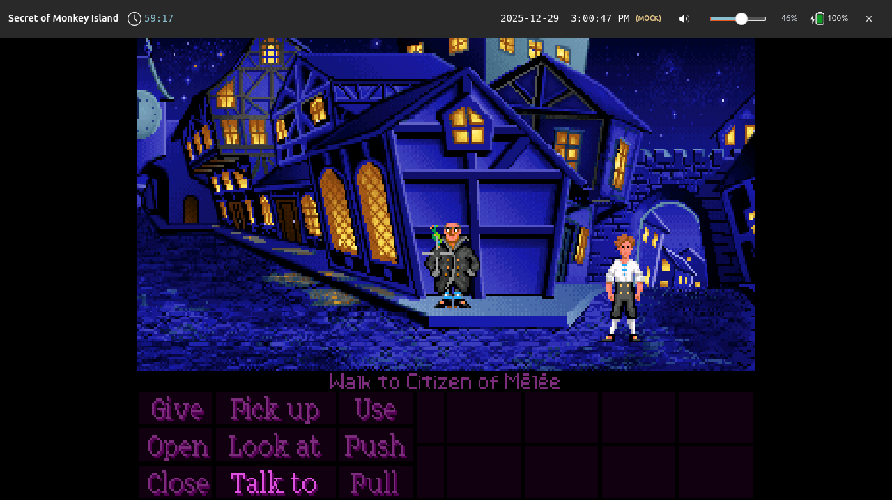
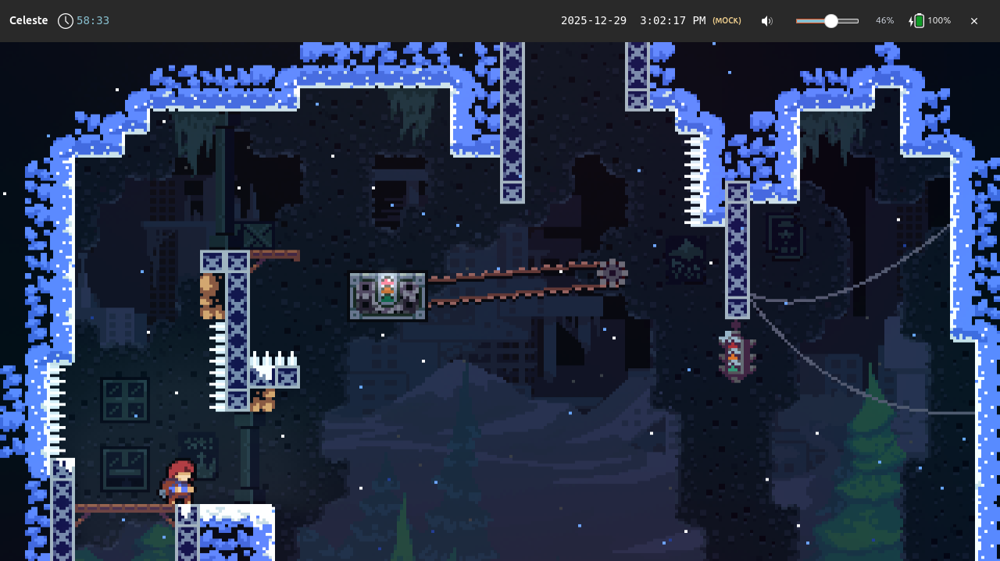
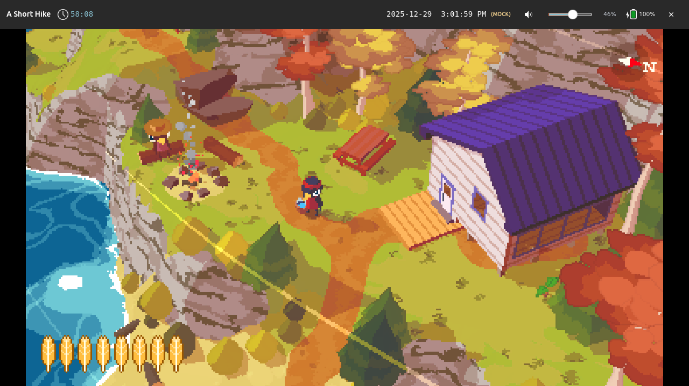
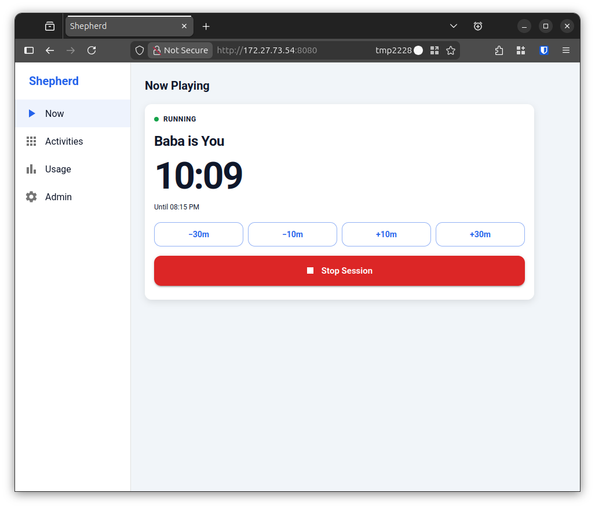
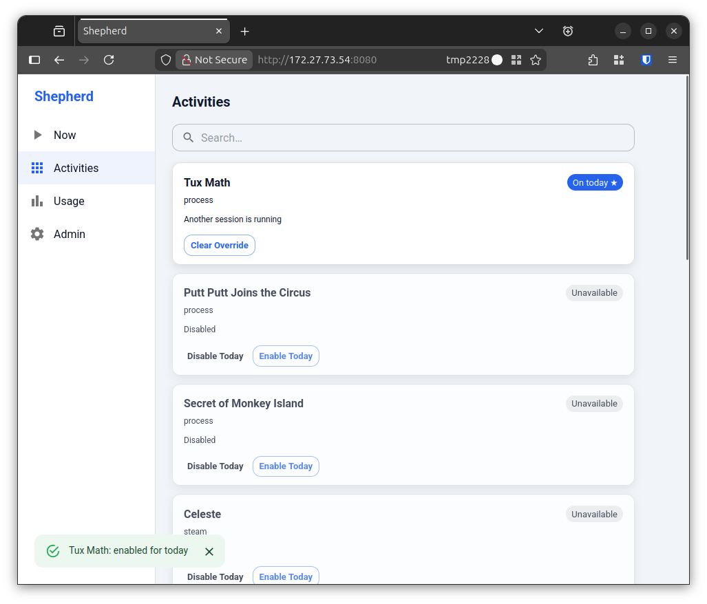

# Lunchbox

A child-friendly, parent-guided desktop environment *alternative* for Wayland,
allowing supervised access to applications and content that you define.

Its primary goal is to return control of child-focused computing to parents,
not software or hardware vendors, by providing:

* the ease-of-use of game consoles
* access to any application that can be run, emulated, or virtualized in desktop Linux
* with granular access controls inspired by and exceeding those in iOS Screen Time

While this repository provides some examples for existing software packages
(including non-free software and abandonware), Lunchbox is
*non-prescriptive*: as the end user, you are free to use them, not use them,
or write your own.

## Screenshots

### Home screen

Lunchbox presents a list of activities for the user to pick from.



The flow of manually opening and closing activities should be familiar.

<video controls src="https://github.com/aarmea/lunchbox/raw/main/docs/readme/basic-flow.webm" alt="Happy path demo showing home screen --> GCompris --> home screen"></video>

Activities can be made selectively available at certain times of day.



This example, shown at 9 PM, has limited activities as a result.

### Time limits

Activities can have configurable time limits, including:
* individual session length
* total usage per day
* cooldown periods before that particular activity can be restarted (skipped
  when the activity only ran for a moment, so a crash on launch costs nothing)

<video controls src="https://github.com/aarmea/lunchbox/raw/main/docs/readme/tuxmath-expiring.webm" alt="TuxMath session shown about to expire, including warnings and automatic termination"></video>

### Anything on Linux

If it can run on Linux in *any way, shape, or form*, it can be supervised by
Lunchbox.


> [Big Buck Bunny](https://peach.blender.org/) playing locally via `mpv`

For collections of media files (local or YouTube), the bundled
[`lunchbox-media`](./docs/lunchbox-media.md) launcher reads a declarative
`.toml` library file and presents either a single direct-play activity or a
browseable poster grid.

Emulated games run through [RetroArch](./docs/emulators.md), which gets its own
activity kind so that closing one saves the game's state and re-opening resumes
it — plus a HUD button to reset the console back to its title screen, which a
resumed save state otherwise makes unreachable.

[Books](./docs/ebooks.md) get one too: an activity per book, opening on the page
the child stopped at, in a reader locked down to reading it — no file dialog, no
settings, no menubar or toolbar, just the page.



> [Putt Putt Joins the Circus](https://humongous.fandom.com/wiki/Putt-Putt_Joins_the_Circus)
> running via [ScummVM](https://www.scummvm.org/)



> [The Secret of Monkey Island](https://en.wikipedia.org/wiki/The_Secret_of_Monkey_Island)
> running via [ScummVM](https://www.scummvm.org/)


> [Minecraft](https://www.minecraft.net/) running via the
> [Prism Launcher Flatpak](https://flathub.org/en/apps/org.prismlauncher.PrismLauncher)



> [Celeste](https://www.celestegame.com/) running via Steam



> [A Short Hike](https://ashorthike.com/) running via Steam

### Local management

Lunchbox optionally runs a management UI and API that can be used to apply
temporary overrides.





## Core concepts

* **Launcher-first**: only one foreground activity at a time
* **Time-scoped execution**: applications are granted time slices, not unlimited sessions
* **Parent-defined policy**: rules live outside the application being run
* **Wrappers, not patches**: existing software is sandboxed, not modified
* **Revocable access**: sessions end predictably and enforceably

## Non-goals

1. Modifying or patching third-party applications
2. Circumventing DRM or platform protections
3. Replacing parental involvement with automation or third-party content moderation
4. Remotely monitoring users with telemetry
5. Collecting, storing, or reporting personally identifying information (PII)

### Regarding age verification

Lunchbox may be considered "operating system software" under the
[Digital Age Assurance Act][age-california] and similar legislation.

[age-california]: https://leginfo.legislature.ca.gov/faces/billNavClient.xhtml?bill_id=202520260AB1043

As legislated, such requirements are fundamentally incompatible with non-goals
3, 4, and 5, and as such, Lunchbox does not implement them.

Usage in California is explicitly allowed under [AB1856][age-california-2],
which exempts applications distributed "under license terms that permit a
recipient to copy, redistribute, and modify the software", such as the
[GPL](./LICENSE.md).

[age-california-2]: https://leginfo.legislature.ca.gov/faces/billTextClient.xhtml?bill_id=202520260AB1856

## Installation

Lunchbox is pre-alpha and in active development. The helper at
`./scripts/lunchbox` can be used to build and install a *fully functional*
local kiosk setup from source:

Check out this repository and run `./scripts/lunchbox --help` or see
[INSTALL.md](./docs/INSTALL.md) for more.

## Example configuration

All behavior shown above is driven entirely by declarative configuration.

For the Minecraft example shown above:

```toml
# Prism Launcher - Minecraft launcher (Flatpak)
# Install: flatpak install flathub org.prismlauncher.PrismLauncher
[[entries]]
id = "prism-launcher"
label = "Prism Launcher"
icon = "org.prismlauncher.PrismLauncher"

[entries.kind]
type = "flatpak"
app_id = "org.prismlauncher.PrismLauncher"

[entries.availability]
[[entries.availability.windows]]
days = "weekdays"
start = "15:00"
end = "18:00"

[[entries.availability.windows]]
days = "weekends"
start = "10:00"
end = "20:00"

[entries.limits]
max_run_seconds = 1800  # 30 minutes (roughly 3 in-game days)
daily_quota_seconds = 3600  # 1 hour per day
cooldown_seconds = 600  # 10 minute cooldown

[[entries.warnings]]
seconds_before = 120
severity = "warn"
message = "2 minutes remaining - save your game!"

[[entries.warnings]]
seconds_before = 30
severity = "critical"
message = "30 seconds! Save NOW!"
```

See [config.example.toml](./config.example.toml) and 
[the Wiki](https://github.com/aarmea/lunchbox/wiki)
for more.

## Development

Build instructions and contribution guidelines are described in
[CONTRIBUTING.md](./CONTRIBUTING.md).

If you'd like to help out, you can find potential work items on
[the Issues page](https://github.com/aarmea/lunchbox/issues) and send me a pull
request right here.

## Written in 2025, responsibly

This project stands on the shoulders of giants in systems software and
compatibility infrastructure:

* Wayland and Sway
* Rust
* Flatpak and Snap
* Proton and WINE

This project was written with the assistance of generative AI-based coding
agents. Substantial prompts and design docs provided to agents are disclosed in
[docs/ai](./docs/ai/).
