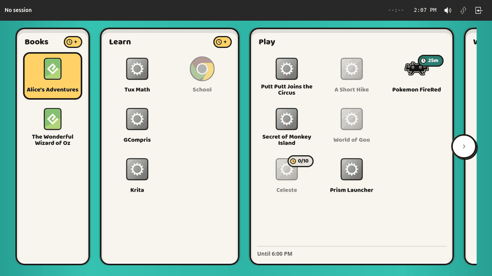
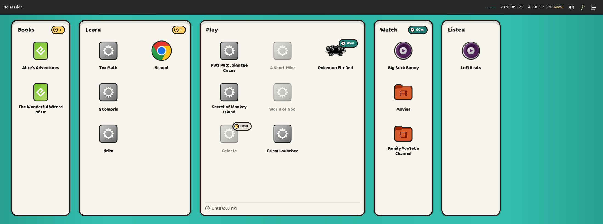
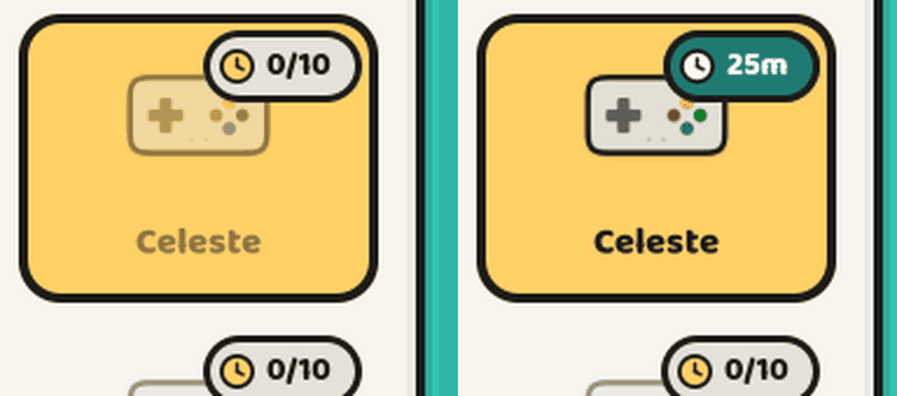

# Launcher branding (#207)

Building the launcher home screen to the "enamel tin" branding delivered with
<https://github.com/aarmea/lunchbox/issues/207>.

## The prompt

> Implement #207

Issue #207 ("Implement launcher branding") is two attachments and no prose: a
1440p mockup of the launcher, and `lunchbox-branding.zip` — a design hand-off
containing the mark, `tokens.json`, a reference `launcher.css`, mockups, a
`README.md` explaining the direction, and an `IMPLEMENTATION.md` briefing an
agent on what to build. The brief is reproduced at the end of this note, because
it is the specification this work was measured against and it is not otherwise
in the repository.

## What it looks like

Screenshots in `2026-09-19-004-launcher-branding/` beside this note. The first
two are `config.example.toml` on a development machine — which is why most
activities wear the theme's generic fallback icon rather than their own: Steam,
RetroArch, GCompris and the rest are not installed here. The third is a
synthetic fixture, and says so.



The design size, and what a device actually shows: three compartments fit, the
row overflows, and the yellow chevron says so.



The whole row on a wider output. Every badge in the vocabulary is here — earn on
Books and Learn, `25m` banked and `0/10` still owed on two activities in Play,
`30m` on Watch's header because the gate is the category's, and nothing on
Listen, which is ungated. Play carries the only schedule, so it has the only
floor.



The same activity selected, locked (left) and unlocked (right). The selection is
identical in both; only the icon and the name dim. See "What 'selected' looked
like" below for why that matters.

This one is **not** from `config.example.toml`: it is a throwaway config holding
one `/bin/true` process called "Example Activity", built so that the item to be
inspected is the launcher's own initial selection — see "Driving the launcher
when the harness will not". The controller is the icon theme's generic
`applications-games`, named by that fixture. An earlier cut of this screenshot
labelled the fixture "Celeste", which was worse than useless: it put a real
activity's name on a fake entry wearing an icon Celeste does not have.

## Scope, as agreed before building

The brief is addressed to "an agent implementing the home screen and HUD in
`lunchbox-webui`", which is not where either lives — the launcher is GTK4
(`crates/lunchbox-launcher-ui`) and the HUD is its own crate. Three decisions
were put to the author before any code was written:

1. **Launcher home screen only.** The HUD is a mature 3.4k-line crate with
   horizontal and vertical layouts, scaling and flyouts; rebranding it is its
   own issue. It is untouched here and still wears its old palette, so a
   screenshot of the running system shows a branded field under an unbranded
   bar. That is expected, not an oversight.
2. **Categories come from `[[groups]]`,** in config order, with ungrouped
   entries falling into a trailing "Everything else". The alternative — adding
   label-only groups to `config.example.toml` so a fresh install looks like the
   mockup — was declined. The example config therefore renders as "Games" plus
   one wide catch-all, which is honest to the config rather than to the mockup.
3. **Baloo 2 is vendored** in `assets/fonts` under the OFL. No Ubuntu release
   packages it and the kiosk is offline by default, so there is nothing to fetch
   it from at first boot.

## What was built

`crates/lunchbox-launcher-ui` gains five modules and loses `tile.rs`:

| File | What it is |
| --- | --- |
| `theme.rs` | The palette, the geometry, and the stylesheet. The Rust half of `assets/branding/tokens.json`. |
| `field.rs` | The row of compartments: categorisation, the D-pad model, horizontal scrolling. |
| `compartment.rs` | One sunk category well: header, badge, stacks, floor. |
| `item.rs` | One activity: icon with an ink keyline, name, badge, press and shake animations. Replaces `tile.rs`. |
| `badge.rs` | The time pills, and the coin glyph that leads them. |

`grid.rs` keeps its flow box, now built from the new item widget. It is
administrator mode's application picker — a searchable list of every `.desktop`
file on the host, for a caregiver — and a row of compartments is the wrong shape
for that.

> Superseded later in this same note, under "One source, not two" and the
> review rounds after it: the picker became the *same* field, handed one
> synthetic category, and `grid.rs` was deleted. Read on before believing any
> of the paragraph above.

### API additions

Three, all driven by something the field has to draw and could not otherwise
know:

- `ServiceStateSnapshot::groups` — the categories, riding the same snapshot as
  the entries. A separate `list_groups` call would have doubled the round trips
  on every `StateChanged` *and* let a compartment's badge disagree with the
  items sitting in it.
- `GroupView::window_closes_at` — for the compartment floor. Distinct from
  `max_run_if_started_now`, which is the shortest of every limit and so says
  when the child must stop, not when the category shuts.
- `EntryView::earns_tokens` / `GroupView::earns_tokens` — for the earn pill. A
  gate names its sources, so a source carries no record of being one; no client
  can derive this, and `Policy::earns_tokens` sweeps the gates to answer it.

## Decisions worth keeping

**Locked activities are now drawn.** The launcher used to skip every entry with
`enabled == false`. It now draws them at 50 % with their badge, because a child
who cannot see Celeste cannot learn that ten minutes of Tux Math would open it.

That is not unconditional. `item::is_shown_when_locked` splits reasons into ones
the child can act on — a closed window, a spent quota, a cooldown, an unmet
gate, a gamepad to plug in — and ones they cannot: a disabled entry, a kind this
host cannot run, a protection that cannot be applied. The second group stays
hidden, as before, because a permanently dead icon in the tin teaches a child to
ignore dimmed items. A new `ReasonCode` has to be classified there; the match is
exhaustive so it cannot be forgotten.

**The selected look is a CSS class, not `:focus`.** Two reasons. The brief wants
hovering to *be* selecting, and one class expresses "exactly one item is
selected" where `:focus, :hover` is two states that can both be true on
different items. And `:focus` did not actually paint under the headless
compositor — `grab_focus()` returns true and GTK agrees the widget is focused,
but the pseudo-class never matched. Focus is still grabbed, for the focus chain
and for screen readers; it is just not what is drawn from.

**The ink keyline is eight GSK colour-matrix draws, not four drop-shadows.** The
brief offers `drop-shadow()` filters. Eight offsets around a 2.5 px ring, each a
colour-matrix node that turns the icon into a solid ink silhouette, work on any
paintable — theme SVG, PNG on disk, pixel art — without touching pixels. Four
offsets give a plus-shaped keyline that visibly corners on round icons.

**Rows reserve space they may not use.** An item's name gets a fixed two-line
box and its badge a fixed slot, whether or not either is filled. Otherwise a
name that wraps pushes its badge down and takes the stack beside it out of
alignment, and the branding is explicit that height never grows — width does.

**The compartment-wide dim was built and then removed.** A shut category dimming
to 40 % is §9 of the brief, which explicitly leaves bedtime to be designed
rather than guessed at. Built, it also dimmed the badge that explains the lock,
which is the one thing worth reading on a locked category. Items carry their own
50 %, which is what the acceptance checklist actually asks for.

## The font, and the hour it cost

Baloo 2 rendered as a plain bold sans for a long time, with no CSS parse error
and `fc-match` finding the font perfectly from the same shell, the same `$HOME`,
and the same environment as the launcher process.

It was a **stale fontconfig cache**. `fc-cache -f <dir>` on the newly-created
font directory was not enough; the global cache had no reason to look at a
directory that did not exist when it was built. A plain `fc-cache -f` fixed it
instantly, and the font has worked everywhere since — including from the user
font directory that appeared not to work before.

Both install paths therefore run `fc-cache` and say so in a comment, because the
failure is silent and looks exactly like a font that was never installed:

- `install_fonts` in `scripts/lib/install.sh` → `/usr/share/fonts/truetype/lunchbox`,
  from `install_system`, so both the from-source install and the `.deb` staging
  get it. The `.deb` gets the cache refresh free from dpkg's fontconfig trigger.
- `install_branding_fonts` in `scripts/lib/deps.sh` → symlinks into
  `$XDG_DATA_HOME/fonts/lunchbox` for `deps install run` and `deps install dev`,
  needing no root, for a stack run out of `target/debug`.

The launcher names Baloo 2 first in a fallback stack, so a device that has
missed the step still comes up — in ordinary lettering.

## Verified on screen

Through the headless dev session (`dev headless --config …` → `dev shot`),
against a scratch config written to put every compartment state on screen at
once — an earning category, a token-gated one, a scheduled one, locked members,
and enough categories to overflow the row:

- Five compartments in config order, sunk, full height, no drop shadow.
- Earn pill on the earning category and *not* repeated on its members; the
  gated category's `0/10`; Celeste's own `0/10` under its name.
- `Until 11:59 PM` on the scheduled category's floor.
- Locked members at 50 % keeping their badges.
- Rows aligned across stacks whether or not a name wraps or a badge is present.
- The row overflowing with the yellow chevron chip, and no vertical scroll.
- Baloo 2 ExtraBold throughout.
- Selection moving with the arrow keys within a stack and across compartments,
  exactly one item selected at a time, pointer hover producing the same state.

**Not verified end to end: the press-then-launch keypress.** The headless
harness could not deliver it. `scripts/lib/headless.sh` already documents that
its synthetic pointer does not fire GTK `clicked`; separately, `wtype -k Return`
(and `KP_Enter`, and `space`, and typed text) exits 0 but never reaches the
launcher's key controller, while arrow keys do — confirmed by logging every key
the controller sees. So the selection, the refusal path and the rendering were
checked on screen, and the launch itself was not. The Enter/space binding is the
same set of keysyms the old grid had, routed to the field instead; what is new
and unexercised is the 120 ms press animation that precedes the launch call.

## Still open

- The HUD (§8 of the brief) — out of scope by agreement, see above.
- Bedtime (§9). Blocked on the engine as well as on design: a compartment floor
  cannot say "Opens 10:00 AM" until `next_window_start` is computed.
  `ReasonCode::OutsideTimeWindow` has carried it since the beginning and nothing
  has ever filled it in — there is a `// TODO: compute next window` in
  `Engine::evaluate_entry` and a matching `None` in `group_reasons`.
  `compartment::schedule_line` is the one line that will want it, and
  `a_shut_category_has_no_floor_yet` is the test that will change.
- Category header icons for pre-readers, and book cover art (§9).

## Follow-up: the example config, and one real bug it found

Asked afterwards to "reorganize the example config into groups so that
screenshots generated from it demonstrate the branding" — the option declined
at the start of this work, now wanted.

`config.example.toml` had one group, `attention-heavy` ("Games"), holding three
Steam/RetroArch entries. It is now five categories — Books, Learn, Play, Watch,
Listen — with thirteen more entries assigned. The old group was *renamed* to
`play` rather than replaced, so it keeps its schedule, its 15-minute burst cap,
its combined hour-a-day quota and its cooldown: the only group with limits, and
still the file's worked example of a shared budget. The other four carry an `id`
and a `label` and nothing else, which is all a category needs.

**No entry moved in the file.** It is still ordered by `[entries.kind]` under
its `## ===` headers, because that ordering is what teaches a reader the kinds.
Category order comes from the `[[groups]]` block and member order from the
entries, so the screen could be arranged without disturbing the lesson.

One semantic change, deliberate: Celeste's gate was
`from = ["tuxmath", "gcompris", "scummvm-putt-putt"]` and is now
`from = ["group:learn"]`. It reads better ("time on anything in Learn earns
Celeste time"), it survives a new learning activity being added, it exercises
the `group:` subject prefix that the config docs describe but nothing used, and
it is what puts the earn pill on the Learn *compartment* rather than repeating
it on each of Learn's members. Putt Putt stops being a source, which is right
now that it sits in Play.

### The bug the screenshot found

At 1280x720 the Play compartment was clipped along the bottom edge. Three rows
plus a header plus a floor did not fit, because the item cell had drifted to
178px against the 150px `ITEM_H` the geometry is built on: the art slot, the
name and the badge added up to 150 *before* the item's own 6px padding and 4px
focus border, and those are inside the cell, not outside it.

Trimmed back — the name reserve from 46 to 40, the item padding from 6 to 3, and
the compartment header and floor margins from 12/10 to 8/8. Worth remembering
that `ITEM_H` is the whole cell including its outline, and that a compartment's
worst case is fixed by construction: three rows is the maximum a stack holds, so
three rows plus a header plus a floor has to fit the design's shortest screen,
and if it does not the row clips rather than scrolls.

### Books, and the two things actually keeping it off screen

The category would not render, and the reason was twice not what it looked like.

The example's only book was `~/Books/the-hobbit.epub` — a copyrighted title the
config tells the reader to supply and ships no file for. It is now two Project
Gutenberg books instead, Alice's Adventures in Wonderland and The Wonderful
Wizard of Oz, both public domain, with the two `curl` commands that fetch them
in a comment above. The example is reproducible now: anyone can run those two
lines and get the screenshot.

That was necessary and not sufficient. With the files in place the compartment
still did not appear, and the obvious suspect — `EbookReaderMissing`, okular not
being installed — was the wrong one: that is a *Warning* diagnostic and blocks
nothing. The actual reason on both entries was `ProtectionUnavailable`. A book
declares `[entries.firewall] default = "deny"`, this host had no firewall
helper, and an activity whose protection cannot be applied does not launch. The
launcher hides that rather than dimming it, by the rule above — the child cannot
act on it — so the category emptied and was dropped.

`scripts/integration-tests/setup-firewall-dev.sh`, which the diagnostic's own
remedy names, fixes it. Worth knowing before spending time on a missing reader:
**read the reason code, not the most plausible-looking diagnostic.** Both were
attached to the same entry and only one of them mattered.

### What the screenshots show

All five categories, the mockup's own set. Books (two members) and Listen (one)
as single stacks; Learn (four, double-wide) wearing the earn pill on its header
and not repeating it on its members; Play (seven, triple-wide) with locked
members dimmed, Celeste's own `0/10` under its name, and `Until 6:00 PM` on the
floor; Watch (three). On a wide enough output all five sit on screen with no
chevron chip, which is also the check that the chip appears only on real
overflow.

## Follow-up: demonstrating the token gate

The config showed the gate's *locked* half and nothing else: Celeste wearing
`0/10`. The pill that says what the feature is actually for — the deep-teal one
with the banked time remaining, `25m` — never appeared, for two reasons.

**A balance is runtime state, not configuration.** A fresh install is at zero by
definition, so no amount of editing `config.example.toml` produces a bank pill.
It is earned by playing the `from` activities, or granted outright through the
management UI's `adjust_tokens`.

**And Celeste cannot show the unlocked half on a development machine anyway.**
It is a Steam entry, so on a host without Steam it carries `NotReady` whatever
its balance is, and stays dimmed.

So the example gained a *second* gate, on Pokemon FireRed — a RetroArch entry,
which evaluates as available on a plain host. It also shows the other spelling
of a source: Celeste earns from `group:learn`, this one from `["tuxmath"]`, so
the file now demonstrates both. Its comment says in as many words what the
launcher draws at each balance, and points at the management UI as the quick way
to see it without playing twenty minutes of Tux Math.

Driven through `adjust_tokens`, the whole lifecycle is now visible from the
example:

| Balance | What the launcher draws |
| --- | --- |
| 0s | `0/10` on putty, item at 50% |
| 300s | `5/10` on putty, item at 50% |
| 1500s | `25m` on deep teal, item live |

### And one on a category

An entry's gate and a category's are the same feature aimed at different things,
and the launcher draws them in deliberately different places — so the example
now carries one of each. "Watch" is gated on `group:books`: reading earns screen
time.

That one line does three things a per-entry gate cannot show:

- the pill lands on the **compartment header**, not on any member, which is the
  branding's "a category's gate shows on the compartment, an entry's under its
  own name";
- all three members dim and undim **together**, which is what "earning unlocks
  every member at once" actually looks like;
- **Books** picks up an earn pill, because naming `group:books` as the source
  makes the category one. It was the only compartment without a badge.

Both halves verified through `adjust_tokens` on `group:watch`: `0/20` on the
header with all three members at 50%, then `30m` with all three live.

With it, every badge in the vocabulary is on screen at once — earn on Books and
Learn, a `25m` bank and a `0/10` need on two entries in Play, a `30m` bank on
Watch's header, and nothing on Listen, which is ungated.

## Two things a reviewer's eye caught that mine had not

**The row's edges did not fade.** Layout rule 5 and §7 both call for the
overflowing edge to fade under the chevron chip; only the chip was built, and
the acceptance line "fade + chip appear only on overflow" was ticked off on the
strength of half of it. A compartment clipped by the viewport ended on a hard
vertical cut. `.lb-field__fade` is now a pair of gradient overlays, enamel at
the outer edge to nothing inwards, shown on exactly the condition the chips are
and sitting under them.

Worth knowing for anything else written against this palette: the far stop is
`rgba(39, 160, 147, 0)` and not `transparent`, because `transparent` is
transparent *black* and a gradient interpolating to it dips grey on the way out.

The first cut of it still had a visible seam, and the reason is worth keeping.
The field's 40px side margins were padding on `.lb-field`, so the scroll
viewport — and the fade with it — stopped 40px short of the screen edge. The
fade painted a flat `#27A093`, the sheen's *edge* stop, at a place where the
sheen had not reached it: about `(41, 166, 152)` against the fade's
`(39, 160, 147)`. Five units, but uniform down the whole height, which the eye
reads as a line.

A fade painted in a single colour can only match a gradient at one point, so
the fix was to make that point the one the fade ends on: the side margins moved
off the field and onto the *row*, the viewport now reaches the screen edge, and
the fade ends exactly where the sheen really is `#27A093`. Content scrolls off
the edge of the screen rather than stopping short of it, which is what it should
have done anyway.

**An initial selection off the first screenful was never scrolled to.** Found
while checking the mirrored left-hand fade: a config whose first available
activity sits in a later compartment came up showing the start of the row with
nothing selected on screen at all. `restore_focus` does scroll, but it runs
before anything is allocated, so the viewport still measures zero and
`scroll_to_cursor` returns early. The rebuild now sets a pending flag that the
adjustment's `changed` handler acts on, which is the first moment the viewport
knows its real size. The brief's "exactly one focused item at all times when the
field is showing" was quietly false before this for any bedtime-shaped policy.

**The chevron chip was white, not yellow** — and had been all along, in every
screenshot taken before this. `.lb-more` set `background-color` but not
`background-image`, and the GTK theme paints a button's own gradient straight
over the colour. `.lb-item` and `.lb-button` had already been given
`background-image: none` for exactly this reason; the chip was missed. Any
control the branding recolours needs both.

## Review, second round: what a touchscreen found

Three things, none of which the headless harness could have shown.

**The chevron chips appeared rather than arrived**, and pressing one teleported
the row. Each chip now rides a `GtkRevealer` sliding out of its own edge, and
every programmatic scroll eases over 220 ms instead of jumping — retargetable
mid-flight, so holding a direction runs the row along smoothly rather than
stuttering between finished animations. The scroll that follows a rebuild still
lands instantly: there is nothing to animate from when the row has only just
appeared.

**A wide compartment took its own title off the left with it**, leaving a
screenful of activities belonging to nothing visible. The header now slides
inside its compartment, pinned to the left of whatever part of that compartment
is showing and never past the compartment's own end. Administrator mode is the
case that needed it most — one compartment holding every installed application,
whose title was gone after the first swipe.

**The selection was present before anyone had chosen anything.** It now starts
absent and wakes on first use: a direction press, a hover, or a tap. The press
that wakes it *reveals* it where it already is rather than moving, so the child
sees the starting point before navigating; a tap on empty space puts it away
again; and a rebuild — boot, or coming back from an activity — starts absent
once more.

That one contradicts the brief, which asks for exactly one focused item at all
times. It is right for a touchscreen, where there is no cursor to explain a
standing highlight and a selection implies a choice nobody has made. Two
consequences worth knowing: pressing A on a launcher showing no selection
reveals it instead of launching — launching something unseen is the worse
failure — and nothing scrolls on boot any more, because there is no selection to
scroll to, so the row simply starts at its beginning.

### A test that passed while the feature did nothing

The header slide shipped broken, and the tests were the reason it looked fine.

The arithmetic moved out of the widget code into a pure function so it could be
checked without a display — right instinct. But the test called it with a
header width of 120 px, a plausible-looking number for a title, and the real
value is nothing like that: the name's bin is stretched across the whole
compartment so that the badge is pushed to the far end, so its *allocated* width
is the compartment's. Feed that in and the clamp becomes
`(well_width − (well_width − 40) − 56).max(0)`, which is zero at every scroll
position on every compartment. The headers never moved at all, and four tests
agreed they were fine.

Two things came out of fixing it:

- **Measure the content, not the box.** Widths now come from `measure`, not from
  the allocation, and positions from `translate_coordinates` into the row's
  coordinates — the same ones the scroll adjustment counts in — rather than from
  an allocation that is relative to a parent.
- **The two halves anchor to opposite edges.** The name holds the left of what
  is visible and the badge the right, so they bracket the part of the category
  you are looking at. One bin around the pair could only move them together,
  which would carry a right-aligned badge off the compartment's far end. They
  are separate bins with mirrored helpers, `leading_offset` and
  `trailing_offset`.

The tests now use geometry measured off the running launcher, and say so.

There was a second clamp bug behind the first: the fade's inset was being used
to limit travel *inside* a compartment as well as to hold the header off the
screen edge. On a narrow category that left almost no room to move, which looks
exactly like the slide not working. The inset is about the screen; a
compartment's own border and padding govern the room inside it.

### The rest, which could not be checked

Keyboard input did not reach the launcher *at all* during this round — eight
presses, zero handler calls, confirmed with a temporary log rather than assumed.
The animations and wake-on-input are unverified here and want the device.

The slide itself was eventually seen, by temporarily forcing the selection
active so a rebuild would scroll, against a config holding one very wide
category whose only launchable activity sits at the end. The chevron step was
wrong too, and reported from the device: it moved one *item*, where a chevron
means a screenful. It now moves a page less one item of overlap.

## Review, third round

Three small ones, and the smallest was the most interesting.

**A clock face on the compartment floor.** The concept images set a little
analog clock before "Until 6:00 PM" and it had simply been missed. Unicode
gives twenty-four faces — twelve on the hour from U+1F550, twelve on the half
hour from U+1F55C — so the glyph is drawn at the hour it is talking about
rather than being one fixed picture. That is the whole reason it earns its
place: a child who cannot yet read "6:00 PM" can still see where the hand
points. Rounding is *down*, never to nearest, because a face showing half past
with twenty-nine minutes still to go would say the time is later than it is.

**The line height belonged in the tokens.** It was a constant in `item.rs`
carrying the value 1.1 with a comment saying the design file specifies 1.1 —
which is the same duplication the second round removed everywhere else, left
behind because it reaches Pango rather than the stylesheet. `build.rs` now
emits `type.*.lineHeight` too (kebab-cased on the way through, since the design
file writes its fields the way JSON does and everything downstream writes them
the way CSS does).

**A module doc that had gone stale.** `field.rs` still described `grid.rs`,
deleted two rounds earlier, and still stated the brief's "exactly one item is
focused at all times" as the rule — which the round before had deliberately
reversed. Both fixed, and the reversal is now written down where someone
reading the file will meet it.

Worth naming the pattern: of the three, two were comments that had quietly
stopped being true. Prose does not fail a build.

## Review, fourth round: a disabled activity, and a sweep

**An entry the caregiver switched off could come back.** `is_shown_when_locked`
asked whether *any* reason was one the child could act on, which meant a config
`disabled = true` was outvoted the moment the entry was also outside its window
— two blockers, one of them a clock, and the clock won. A permanent blocker is
now a veto checked before the vote: switched off is switched off, however many
other reasons agree. The same goes for a kind this host cannot run and a
protection it cannot apply, neither of which will ever clear.

`ManuallyDisabled` deliberately stays on the shown side. "Not today" is a thing
to wait out, and the badge saying so is worth drawing; "not at all" is not.

### The sweep

Asked to look for other comments that had gone stale, and there were several —
all of them prose that had quietly stopped matching the code:

| Where | Said |
| --- | --- |
| `README.md`, Selection | "Exactly one item is selected whenever the field is showing" |
| `README.md`, Styling | the picker keeps its own flow box, in `src/grid.rs` |
| `README.md`, Launch Flow | "Grid input disabled" — a thing that no longer happens |
| `README.md`, State Management | a `LauncherState` struct with four fields, matching nothing |
| `field.rs`, `restore_focus` | "the rule is that *something* is always focused" |
| `theme.rs`, `--selected` | "there is exactly one selected item" |
| `item.rs` ×3 | pointed at `tile.rs`, deleted three rounds ago |

The `LauncherState` block predates this work; the rest are all mine, and every
one of them was true when written. That is the whole difficulty: none of it
fails a build, none of it fails a test, and the only thing that catches it is
somebody reading carefully — which is what a reviewer is for, but not what they
should have to spend their attention on.

The history note also had a paragraph describing `grid.rs` as kept, written
before the round that deleted it. It is a record rather than living
documentation, so it keeps what it said and carries a pointer forward instead.

## Review, fifth round: the emoji clock, and a crate for one widget

The Unicode clock face from the third round did not survive its own review:

> Particularly, the colors are not from the theme, and the skeumorphic design
> does not match the rest of the flat appearance. Let's use the clock from the
> HUD in vertical mode instead. You'll probably need to pull it out somewhere
> the launcher can consume it, then update its appearance to match the concept
> image, making sure to make it so that the size and color can be passed in so
> that the HUD version can still (roughly) fit in.

Both halves of that are right, and the second is the reason the first happened.
A glyph is the cheapest possible picture: `format!("{face} Until {time}")` and
there is a clock on the floor. What comes with it is a picture nobody in this
project drew — whatever face the system emoji font ships, in whatever colours
its designer chose, with the bevels and gradients an emoji set has and this
branding explicitly does not. Every other colour on the screen comes out of
`tokens.json`; that one came out of Noto.

### The crate

There was nowhere for a shared widget to go. `lunchbox-launcher-ui` and
`lunchbox-hud` are both binary crates that happen to use GTK, and neither can
depend on the other. So `crates/lunchbox-widgets`: GTK and drawing only, no
daemon, no state, nothing from this repository but `lunchbox-util` — which the
clock needs, because it has to respect `LUNCHBOX_MOCK_TIME` like everything
else that reads the hour.

One widget is a thin reason for a crate, and the alternative — copying 40 lines
of cairo into the launcher — is how two clocks come to disagree about what a
clock looks like. `OffsetBin` is the other candidate to move there eventually;
it stays in the launcher until something else wants it.

### Size in, colour in

The reviewer's constraint is the interesting part of the design. The two
callers want the same face at 14 px and at 36 px, in muted ink and in cream, and
a drawn widget gets neither for free:

* **Size** is a number, because it has to be: nothing drawn goes through either
  stylesheet, so a face cannot be sized by a CSS rule. `ClockFace::now(px)` /
  `ClockFace::at(time, px)` take it, `set_diameter` changes it, and everything
  in the draw function is a fraction of it. The HUD already had this shape —
  it re-tells the face on every scale change, beside the icon `set_pixel_size`
  calls — and the launcher scales once at build time.
* **Colour** is CSS, read back with `Widget::color()`. `color` inherits in GTK
  CSS, so this is the one property a drawn widget can still take from the
  stylesheet, and it means neither caller has to hold a palette: the HUD says
  `var(--text-primary)`, the launcher says `@color-muted@`, the same token the
  line beside it uses.

There is also a real difference between the two faces that is not size or
colour. The HUD's shows **now**, and has to be told to redraw. The launcher's
shows **when the category shuts** — a time being talked about, not the time it
is — and never changes. So the time is a constructor argument too, `None`
meaning "read the clock in the draw function".

### The appearance

Flat: a rim and two hands. The HUD's version also drew four quarter-hour ticks,
which were there to make a 36 px face readable and are wrong for this branding
at any size. The ring's weight is the one number measured off the concept image
rather than reasoned out — a 16 px face carries a 1.75 px ring — and it is
clamped at both ends, because the same ratio that reads correctly at 14 px
greys out below that and closes into a doughnut at the sizes the HUD asks for
on a large output.

The floor's face is drawn two pixels larger than the type beside it, derived
from `type.footer.size` rather than written down, so it reads as a picture
rather than as one more glyph in the line — which is, in the end, exactly what
the emoji had been.

One thing only a screenshot found: the hour hand has to be *much* shorter than
the minute hand, and a little heavier. Six o'clock is the closing time in half
the examples in this repository, and at six o'clock the hands are exactly
opposite — two near-twins there draw one straight line across the face, which
reads as a crossed-out circle rather than as a clock. 0.45 and 0.80 of the
radius, at 1.1 and 0.7 of the ring's weight.

The HUD's own appearance changed slightly with the move. That is sanctioned:
the bar is being restyled in #209 anyway, and the reviewer said "roughly".

## How tall is a stack, really

Asked where the limit of three activities per column comes from. It came from
`space.rows` in `tokens.json` and nowhere else — the design hands down a three,
`build.rs` turns it into a constant, and `split_into_stacks` chunks by it.
Nothing derived it and nothing checked it.

Three is right for the screen the design was drawn for. It is not right for the
screen the launcher is on, and the reason is a rule from two rounds earlier:
`scale_for` takes the *narrower* of the two axes so the layout never reflows.
On anything taller than 16:9 that leaves height under every compartment which a
fixed three simply wastes; on anything shorter it clips, and there is no
vertical scroll to catch it. Nothing asserted the budget either — raising
`space.rows` to four would have built, passed every test, and clipped.

So the field works it out per layout, and **measures rather than calculates**.
A compartment's vertical budget is the field's padding, the compartment's
border and padding, a header, a floor, and *n* item cells with gaps between
them — every one of those numbers lives in the stylesheet, and the arithmetic
that reproduced them is precisely what drifted before: the earlier round of
this work found the item cell at 178px against the 150px the geometry assumed,
which is what made a compartment clip at 720p in the first place. So
`rows_that_fit` builds a throwaway `.lb-field` → `.lb-field__row` →
`.lb-compartment`, measures it empty, appends one item, measures again, and
divides. The only thing left to test is the division, which is pure.

Three details worth keeping:

- **The probe is the worst case** — a header wearing a badge, and a floor,
  which not every category has. One number then fits every compartment in the
  row, and their items all start on the same line. The old "fixed by
  construction" invariant, kept, but now it is construction that checks it.
- **Never zero rows.** A screen with no room for even one item is one this
  design cannot serve; showing a clipped activity says so, and an empty tin
  lies — it reads as "this category is gone".
- **The token is now the fallback**, used before the window knows its size (the
  first layout after startup is always a re-layout) and if a measurement comes
  back nonsense. It is still the design's number and still the right one at
  1280×720.

Checked on three screens: 1280×720 gives three, unchanged; 1280×1024 gives five
and pulls the whole five-category row onto one screen; 1280×420 — where the
0.75 scale floor means the design no longer fits at all — gives two, where the
fixed three clipped.

## A floor on the width, too

The same question from the other side: a category with one stack is exactly one
item wide, and the header has to fit a name *and* a badge pushed to the far end
of that one line. The name label does not ellipsize, so at that width it is the
*compartment* that gives — it stretches to whatever the words need, which puts
every badge back at a different offset and undoes the reason for pushing them
to the end in the first place.

So the items area carries a floor of two columns and the gap between them —
set on the box holding the stacks rather than on the well, so the compartment's
own padding and border are still added on top of it by the stylesheet, and the
floor stays expressed in the same geometry the items are laid out on. A whole
number of columns matters: a floor of, say, 250px would leave a compartment
wider than its items and narrower than the next stack, which reads as a
mistake.

It is not free: at 1280×720 three compartments fit across where four and a half
did.

### And the gap goes to the bottom

The first cut of the floor left a category holding two books showing them in a
column with an empty column beside them, which does not read as "this category
has two books" — it reads as a section of the lunchbox somebody forgot to pack.
So the members are now dealt *across* the columns in reading order, the top row
left to right and then the row under it, and the gap falls along the bottom
where an unfilled compartment is simply unfilled.

The geometry does not change at all: a category with seven members and room for
three rows is three columns wide either way, and what `split_into_stacks`
returns is still the columns, because that is the shape the D-pad model is
built on — left and right move between them, up and down inside one. Only the
dealing turned ninety degrees. Two things had to be said out loud in the
arithmetic: never more columns than the two-column floor asks for, and never
more columns than there are members to put in them — one member and a floor of
two would otherwise conjure a column with nothing in it, which is a dead stop
for the selection.

The tests changed shape with it. They used to name the members and check the
order survived; now they mostly check the *shape* — `[2, 1]` for three members
with room for three rows, `[3, 2, 2]` for seven — and one of them reads the
members back in screen order to check that config order really is reading
order.

## Two compartments to a column

The last of the three: a category only needs the height its own items take, so
two short ones can stand one above the other where the brief gives each a
compartment the full height of the screen. With the example configuration at
1280×720 that is the difference between five categories across five columns —
two of them mostly empty, the last one off the edge — and five categories in
three, all of them on screen.

The rule is *iff both fit*: heights are measured off the built compartments
(`widget.measure`), not guessed, because a category without a schedule has no
floor and guessing the worst case would cost it the pairing it can actually
have. The packing is greedy and strictly in configuration order, so reading a
column downwards and then moving right reads the categories in the order the
file lists them. A cleverer fit exists — with the example config, Books would
pair with Listen where it does not pair with Learn — but it buys that by moving
categories around, and a home screen whose sections rearrange themselves when
one of them gains an activity is worse than one with a gap in it. A compartment
too tall for the field at all still gets a column to itself: that is
administrator mode's picker, which holds every application on the host.

### What it cost elsewhere

Three things, and two of them were the sort that only show up on screen.

**The D-pad stopped being about compartments.** `Stack` was "one column of
items, and the compartment it sits in"; it is now "one column of items, and the
*field column* it sits in", and its items are every item at that x — which, in
a column holding two compartments, runs from the end of the upper one straight
into the start of the lower one. That is what makes Down carry on downwards
across the join rather than stopping at it, and it needed no change to
`move_selection` at all: the model was already a flat list of columns, and the
only thing that changed is which items are in one.

**Two places were reading x out of an allocation.** An allocation is relative
to the parent, and compartments are children of their column now rather than of
the row, so `allocation().x()` stopped meaning what `scroll_to_cursor` and
`slide_headers` thought it meant — the latter would have put every header in
the field at the same place. Scrolling now measures the column, which *is* a
child of the row; the headers use `translate_coordinates` like the name and
badge beside them already did. Verified with a scratch configuration of six
categories whose only launchable activity is the last one, so the row lands
scrolled to its end: the third category, clipped by the left edge of the
screen, still shows the tail of its name.

**The compartments in a column share a width.** Whatever the widest of them
needs, the others take, or a column of the tin reads as two tins that happen to
be above each other.

## Forty pixels is not worth a gesture

The row scrolls when it has to, and that is right for a row that genuinely does
not fit. It is a poor answer for a row that is forty pixels too wide: the child
gets a chevron, a fade and a whole gesture to learn, in order to reach a strip
of screen narrower than an icon. So under **half a cell** of overflow, the
cells give it up instead; above that the row really is too big for the screen,
and squishing that far would shrink every name on the field to buy a
compartment that was never going to fit anyway.

This is safe to do after everything else because a cell's width feeds nothing
that was decided earlier — the rows a column holds, the columns a category
needs, the pairing of compartments into fields all came from the *height*
budget, and none of them changes when a name wraps a character sooner.

### Three floors, and the one that mattered

A GTK minimum is the largest of everything that asks for one, and that took
three goes to get right.

1. **A size request is a floor, not a ceiling.** Asking a cell to be 140px wide
   changes nothing when its name already wants 157. That needed a `measure`
   override on `LauncherItem` capping the natural width — the same trick
   `NAME_MAX_CHARS` plays on the label, one level up. The *minimum* is left
   alone on purpose: GTK raises natural back to minimum, so a cell can never be
   squished below the icon and padding it actually needs, however small a cap
   it is handed.
2. **The name has a floor of its own, inside the cell.** With the cap in place
   and the name still asking for its 139px box, the cell's minimum stayed at
   154 and the cap never bit. Nothing moved, four passes in a row, and the
   measurements said so: `now=1399` after every pass.
3. **Dropping that floor altogether is tempting and wrong.** The name is
   centred, so with no floor it shrinks to the width of its own text and the
   wrap point comes with it: "Krita" rendered as "Kr-" over "ita", and
   "GCompris" as "GCo-" over "mpris". The floor comes *down* by what the cell
   gave up instead, measured rather than assumed — the chrome is whatever the
   cell's minimum exceeds the name's request by.

With the example configuration on a 1342×720 screen: overflow 57, cell 149,
squished to 140, four pixels to spare. At 1280×720 the overflow is 119 against
a 74-pixel budget, so nothing is squished and the row scrolls, exactly as
before.

### Reported from the device: the two ends did not match

> it doesn't scroll now with the config I'm testing with, yes, but the spacing
> on the left of the field is not the same as the spacing on the right

Two separate things, and the squish only made the first one visible.

**The row packs from the left.** It carries the field's 40px side margins
itself, and any slack beyond them — from the squish, or simply from three
compartments not adding up to the width of the screen — fell entirely at the
right-hand end. 40 on the left, 90 on the right. The row is now centred, which
costs nothing when it is wider than the screen (it takes its natural width and
scrolls, and `halign` has no say) and squares the two ends when it is not. At
1280×1024, where nothing is squished at all, the margins went from ragged to
48 and 48.

**A cell was not one width.** `space.item-w` was a size request, which in GTK
is a floor: a cell ended up as wide as the greater of it and the cell's own
name, so a long name made a 157px cell and a short one left it at the 149px
floor. Cells at every width between the two, which is not a grid, and it broke
the squish's arithmetic outright — stepping down from the token's 149 took
17px off a 157px cell while believing it had taken 9. Cells are now capped at
exactly the token width, using the same ceiling the squish uses.

**And the squish measures more than once.** A `measure` taken in the same turn
as the size request that provoked it does not reliably agree with the
allocation that follows — before the squish it read 32px of overflow where
there were 63, and after it read a row 43px wider than the one that was drawn.
Dividing once and trusting it left the row three pixels over and still
scrolling. So it narrows, asks again, and stops when the row fits; it can
overshoot slightly, and the centring turns that into a slightly wider margin at
both ends rather than a visibly wrong one at a single end.

### A note on seeing any of this

None of it was visible from a screenshot — the row looked identical whether the
squish had run and done nothing or never run at all. The `debug!` lines that
settled it were not reaching anywhere either, and for two reasons worth writing
down: `RUST_LOG` was not passed into the headless session (sway and lunchboxd
start these binaries, so there is no command line to add a flag to), and the
obvious filter is wrong — a binary crate's root module is named after the
*binary*, so it is `lunchbox_launcher`, never the package's
`lunchbox_launcher_ui`, which matches nothing and looks broken rather than
wrong. Both are now in `scripts/lib/headless.sh` and the `headless-dev` skill.

## Two places the implementation departs from the mockup

Both asked for after seeing it running, both deliberate, and recorded here
because the reference images in the issue still show the older arrangement.

**A category's badge sits at the end of its header**, not tucked against the
name. Across a row of compartments of different widths, name-adjacent badges
land at a different offset in each one; at the end they line up with each
compartment's own right edge.

The catch was in the layout, not the look: the name label takes the slack to
push the badge over, and GTK computes a widget's expansion from its children
unless the widget states its own — so that propagated out to the row and every
compartment stretched to fill the viewport. A category's width would then have
come from how much screen was spare rather than from how many stacks it holds,
which is the one thing §3 of the brief fixes. It only showed on a wide output;
at 1280 the row overflows and there is no slack to reveal it. The compartment
now states `set_hexpand(false)` for itself.

**An activity's badge rides the icon's top-right corner**, the way a
notification count does, rather than taking a row under the name. The brief's
layout gives every item a badge row whether or not it has a badge — and it has
to, since a reservation that appears only on badged items would push their
neighbours out of line. Most activities have no badge, so that row was height
spent on nothing for nearly all of them. Overlaid, the reservation disappears
and the cell drops from 150px to 132px.

The badge is deliberately not clipped to the icon: a `10/30` pill is slightly
wider than the 78px art slot, and the item has 41px of slack each side plus the
16px column gap, so it has room to hang over the corner without reaching the
next item.

## What "selected" looked like, and two things it turned up

Looking at a *badged* item while selected — which nothing had done until it was
asked for — found two contrast faults.

**A locked item's selection was washed out.** `opacity: 0.5` sat on the whole
cell, so it took the selection down with it: the yellow fill became pale butter,
the 4px ink outline went mid-grey, and the badge faded with everything else.
Moving the D-pad across a compartment of locked activities gave almost no "you
are here" — and the brief's own checklist says focus is always visible.

The 50% now applies to the *activity* — its icon and its name — and not to the
cell. Focus reads identically whether or not the thing under it can be launched,
and the badge stays at full strength, which is what the branding means by a
locked item *keeping* its badge: it is the one part worth reading there.

**A yellow badge on a yellow selection dissolved.** The earn pill and the
selection fill are the same `#FFD166`, so a selected item wearing one kept its
ink outline and its coin but lost its body: a hole punched in the selection
rather than a badge on it. Selected, the earn pill's body is now cream.

Only that pill needs it — bank is deep teal, need is putty, and both stand off
yellow by themselves. The case is not reachable from the example config, where
categories carry the earn pill and a compartment header is not selectable, but
it is reachable from any config that names an entry rather than its group as a
token source.

## Review: one source, not two

> not a huge fan of the duplication here, let's have one generate the other

`theme.rs` opened by asking whoever edited `tokens.json` to come and make the
same edit again, which is a comment admitting a design problem rather than
solving one. The token file now generates the Rust.

`build.rs` reads `assets/branding/tokens.json` and writes `tokens.rs` into
`OUT_DIR`, in two shapes because there are two kinds of consumer: typed
constants for the code that measures and draws, and a name-to-text table for
the stylesheet, which is a string and wants text. `theme.rs` includes it, and
the CSS reaches the table through `@name@` placeholders resolved on the way out.
Every colour literal is gone from the stylesheet — including the sunk
compartment's five-part shadow and the field's sheen, which were the two worst
things to have been copying by hand.

Build-time rather than committed, which is the opposite of what the wire codegen
in this repository does. That one commits its output and pays for it with a
drift test, because it crosses into Kotlin and TypeScript where a build script
cannot follow. Nothing here leaves Rust, so there is no artifact to go stale and
nothing to check.

Three things worth knowing about the result:

- **Order matters.** Tokens are substituted before `scale_px_literals` runs,
  because a token carries a bare number and the stylesheet spells the unit
  (`@radius-compartment@px`). Substituting afterwards would leave every
  token-derived length stuck at its design size. There is a test.
- **An unknown token is a panic.** A stray `@earn-colour@` would make its rule
  invalid, and GTK drops invalid rules silently — a failure that reaches a
  screenshot rather than a build.
- **Deliberate departures stay visible.** `ITEM_H` is the design's row height
  *minus* the row the badge no longer needs, written as a subtraction from the
  token rather than as a new number, so a change to the design still carries.
  The art slot stays hand-written because the token file states it only in a
  description.

Checked by turning `color.yellow` magenta and rebuilding: the selection fill,
the earn pills and the cairo-drawn coin all followed, with no Rust touched.

Also: generated code has to pass the same lints as written code. The first cut
emitted `255.0 / 255.0` — clearer about where the number came from, and rejected
by clippy's `eq_op`.

## What this does to administrator mode

The picker (#154) shares the item widget and the stylesheet with the child's
field, so most of this reached it without being aimed at it: the enamel ground,
the branded search bar, ink keylines on the `.desktop` icons, Baloo 2 names.
Its flow box is deliberately kept — a searchable list of every application on
the host is a different problem from a tin with sections.

One thing it *lost*, and it took entering the mode to see: the selected look
moved onto a class the field applies as its cursor moves, and the picker had no
cursor of its own, so it fell through to the **theme's** selection colour —
orange, on Ubuntu, on a cream-and-enamel palette.

The first fix taught the flow box to apply the same class. The better one was
to stop having two of everything: the picker is now the *same* `LauncherField`
the child gets, handed one synthetic category holding every installed
application. `grid.rs` is deleted. Nothing about the colours is special-cased
any more — the sunk well, the selected cell, the item treatment, the horizontal
scroll and its fades all arrive because it is the same widget.

Two things that only showed up once the picker was a compartment:

- **`scroll_to_cursor` scrolled to the wrong end.** It aligned the selected
  item's *compartment* to the left margin, and for a compartment wider than the
  viewport it fell back to showing that compartment's right-hand end — so the
  picker opened scrolled to the far right, past every application. The child's
  field never hit it, because three stacks always fit. It now aligns the
  compartment when the compartment fits, and otherwise scrolls the least amount
  that brings the *item* into view, inset by the fade's width so the selection
  is never the thing dissolving.
- **The field did not claim its height.** As a stack page it got the window
  either way; sharing a box with the search entry it took only its natural
  height, so a one-result search sat in a well one item tall. It sets
  `vexpand` for itself now.
- **Nor its width.** `.admin-picker` had 48px of side padding, which inset the
  field and reproduced the seam exactly as the child's field had it: the fade
  ended 48px short of the screen, painting the sheen's edge stop where the
  sheen had not reached it. The padding is vertical now and the search entry
  holds itself off the edge instead, at 40px so it lines up with the first
  compartment. Same fix, same reason — a fade in one colour can only meet a
  gradient where that colour actually is.

The keyboard follows whichever field is on screen. Two carve-outs for the
picker, which has a text entry the child's field does not: space is left alone,
because a search query can contain one, and WASD is left alone, because those
are letters someone is typing.

One thing it gained. `setup_keyboard_input` used to capture the arrows, Return
and space at the *window*, in the capture phase, and hand them to the child's
grid whatever was on screen — so in administrator mode they reached neither the
search box nor the picker, and simply did nothing. It now proceeds unless the
state is `Idle`, so those keys go to whatever holds focus. That is a reading of
the code, not a measurement: the harness would not deliver the keys to confirm
it, the same way it would not deliver `Return` to confirm a launch.

### Driving the launcher when the harness will not

Neither the pointer nor the keyboard is dependable here. The pointer never
reaches the app at all — `headless.sh` documents that its synthetic pointer does
not fire GTK `clicked`, and motion does not arrive either, so hover cannot
select. The keyboard arrives intermittently: a poll that presses a key and
diffs two screenshots finds a live window, but keys are still dropped inside it,
and `Return` never arrives at all.

What worked instead was making the state deterministic and taking the keyboard
out of it: a scratch config where the item to be inspected *is* the launcher's
initial selection. The focus rule is "previous, then last launched, then the
first launchable item, then simply the first" — so a config in which nothing is
launchable selects its first item, and one where exactly the intended item is
launchable selects that. Two boots, no keypresses, both states captured.

### Talking to the daemon by hand

Worth writing down, because the first attempt failed silently and looked like a
refused connection. **The management socket is not JSON-RPC 2.0**, despite the
shape. The frame is newline-terminated
`{request_id, api_version, method, params}` — see `Request` in
`crates/lunchbox-api/src/commands.rs`. A `{"jsonrpc": "2.0", "id": 1, …}`
envelope deserialises to nothing, and the daemon simply never answers: the
connection stays open, and the client blocks until its own timeout. There is no
error frame to read, so the symptom is indistinguishable from the peer check
having rejected you.

---

## Appendix: the brief, as delivered

Reproduced verbatim from `branding/IMPLEMENTATION.md` in the issue's
`lunchbox-branding.zip`. Its references to `lunchbox-webui`, to `launcher.css`
and to the `reference/*.png` mockups are the hand-off's own; see "Scope" above
for what was done with them.

<!-- The brief refers to a `--lb-scale` CSS variable and to `.lb-item__art`
     etc. from its reference stylesheet. Those class names survive in
     `theme.rs`; the CSS file itself does not, because GTK4 CSS is not the
     web's. -->

```markdown
# Launcher implementation brief

For an agent implementing the home screen and HUD in `lunchbox-webui` to the
branding in this folder. Read `README.md` first for the *why*; this file is the
*what*. `tokens.json` and `launcher.css` carry every number; don't retype them.

## 1. Scope

- Home screen (the "field" of compartments) and its D-pad / pointer / touch
  behavior.
- HUD bar: launcher state and in-activity state.
- Selection and press states.
- Locked / gated presentation, per the token-gate feature (`[entries.tokens]`,
  `[groups.tokens]` in `config.example.toml`).
- Out of scope here: the management web UI, the setup/pairing overlay, bedtime
  screen (see §9).

## 2. Data → screen

One **compartment** per category, in config order. A category is a `[[groups]]`
entry; entries with no group go in an implicit trailing "Everything else"
category, or in per-kind defaults (Books / Watch / Listen) if you already derive
those. The sketch used: Books, Learn, Play, Watch, Listen.

Each compartment shows: the group's label at 22/800; a category badge (an
*earn* pill if this group is a `from` source for any gate; a *bank* pill with
the group balance if the group is gated; none otherwise — one pill max, earn
wins over bank if both); its member entries in config order, 3 per stack then a
new stack to the right; and a footer with the group's next closing time today
(omitted when always-available).

Each item shows: the entry's icon at 64 px with an ink keyline, no plate; its
label at 16/800 wrapping to 2 lines max at 150 px; and an item badge — a *bank*
pill when the entry's own balance is at or above `minimum_seconds`, a *need*
pill `have/need` when below. Only when the entry has its own gate; group-level
gates show on the compartment instead. Locked (balance below the minimum, or
outside the window, or quota spent, or cooling down): 50 % opacity, keep the
badge; for cooldown the badge becomes a clock pill "8m".

Minutes in pills: integer minutes, `m` suffix on bank pills (`25m`), bare on
need pills (`5/10`). Cap the need pill at the threshold: once earned, it becomes
a bank pill.

## 3. Geometry (1280×720 logical)

- HUD 56 px. Field below it. Row starts at x=40, y=24; bottom margin 28.
- Compartment width = `stacks × 160 + (stacks−1) × 16 + 2 × 16 + 2 × 4`. Height
  = full field height (all compartments stretch to the same height).
- Gap between compartments 28.
- Item cell 160 × 150; icon slot 78 with a 64 px icon; 8 px row gap; 16 px
  column gap.
- Scale the whole thing with `--lb-scale` for other resolutions (1920×1080 →
  1.5). Don't reflow: the layout is one row at every size; scale keeps the
  ratios.

## 4. Sunk compartment

Exactly `--lb-shadow-sunk` in `launcher.css`. No outer drop shadow. If the web
view can't do multiple inset shadows cheaply, the priority order is: top inner
shadow (10 px, 10 % black) → outer 3 px ring (12 % black) → bottom inner light
line → side shades.

## 5. Ink keyline on icons

Four `drop-shadow(±2.5px …)` filters on the icon's container (see
`.lb-item__art`). This works on transparent PNG/SVG. Two cases need care:

- **Opaque icons** (JPEG, baked background): the keyline traces the rectangle,
  which is fine — it looks like a framed tile.
- **Performance**: four drop-shadows on 15+ icons is fine on desktop GPUs; on a
  Pi or a Wayland software path, pre-render the keyline into the icon cache at
  install time instead (dilate the alpha by 2.5 px, fill with ink, composite the
  icon over). Same result, no runtime filters.

## 6. Focus, selection, press

- **Focus model**: exactly one focused item at all times when the field is
  showing. Initial focus: last launched entry if it's on screen and available;
  else the first available item in the first compartment.
- **D-pad**: left/right move between stacks (across compartments when at an
  edge); up/down within a stack; wrap vertically inside a stack; don't wrap
  horizontally (hitting the end nudges the scroll instead).
- **Selected look**: `.lb-item:focus-visible` — yellow fill, 4 px ink outline,
  18 px radius, 80 ms.
- **Press (A / Enter / tap)**: add `data-pressed` for 120 ms (scale 1.12, rise
  4 px, 5×6 ink shadow, easing `cubic-bezier(0.2, 0.9, 0.3, 1.3)`), then launch.
  Respect `prefers-reduced-motion`.
- **Locked items** are focusable (so the kid can see the badge) but press does
  nothing except a 120 ms shake of the badge; never launch.
- **Pointer / touch**: hover = focus; click = press. No hover-only affordances.

## 7. Horizontal scroll

- The row translates on X; never scroll Y.
- When the focused item is clipped, translate so its compartment is fully
  visible, aligned to the left margin.
- Show `.lb-field__fade` + `.lb-field__more` on the right only while content
  overflows to the right; mirror on the left when scrolled.
- Wheel / two-finger horizontal scroll and touch drag also move the row.

## 8. HUD

Launcher state: `[mark] Lunchbox [No session] …spacer… 3:00 PM [vol] [batt] 97%
[×]`. Use `icon/lunchbox-small-on-dark.svg` at 26 px.

In-activity state: `[mark] [app icon 34 px, keyline] Minecraft 12:40 left
…spacer… [jar pill] 3:12 PM`. The jar pill shows the balance that this session
is *spending* (the entry's own gate, else its group's). During a *source*
activity show the jar that's *closest to its threshold* among the gates it
feeds, filling; on crossing a threshold, swap the pill for a yellow toast
"Celeste is ready" for ~3 s, then back. Existing warning messages from
`[[entries.warnings]]` render as the same toast in yellow (warn) and
putty-on-ink (critical).

## 9. Not covered, decide when you get there

- **Bedtime / nothing available**: proposed as the same row with every locked
  compartment dimmed to 40 % and its floor reading "Opens 10:00 AM"; any
  always-available compartment stays lit. Draw this before building.
- **Category header icons** if the words are dropped for pre-readers.
- **Book covers**: use the reader's cover if available; else the generic book
  glyph on a tinted plate as in the mockups (the one place a plate is allowed).

## 10. Acceptance checklist

- [ ] Compartments are sunk (inner shadow), no drop shadow anywhere on the
      field.
- [ ] 16 px inside every compartment: left, right, top, between stacks.
- [ ] A category with 4–6 members renders as a double-wide compartment; 7–9
      triple.
- [ ] Earn / bank / need pills appear exactly where §2 says, one per slot.
- [ ] Footer only on scheduled categories; text is the *next* closing time
      today.
- [ ] Focus is always visible; press animates then launches; locked never
      launches.
- [ ] Row scrolls horizontally only; fade + chip appear only on overflow.
- [ ] HUD in-activity shows the correct jar and updates each second.
- [ ] Baloo 2 self-hosted; no text below 12 px; 4.5:1 contrast on all text.
- [ ] Screenshot at 1280×720 matches `reference/launcher.png` in structure
      (icons will differ).
```
