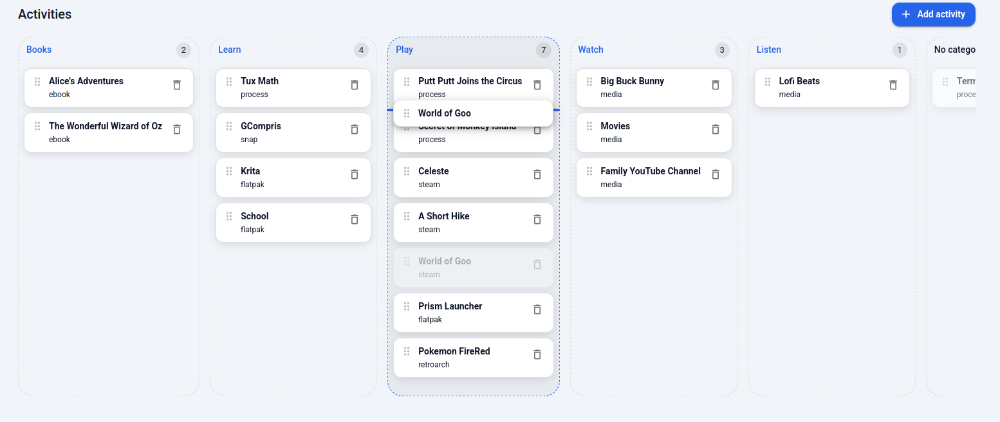
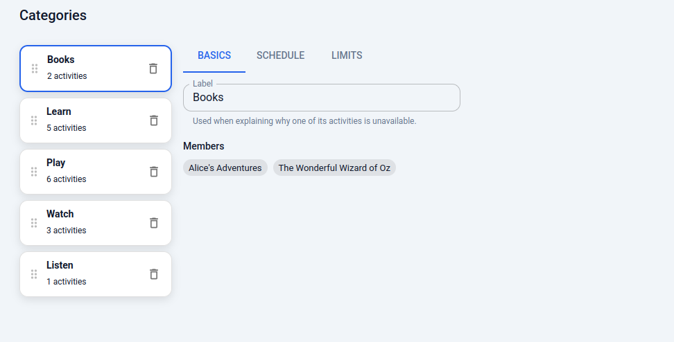

# Reordering activities and categories in the config editor (#210)

**Date:** 2026-09-21
**Issue:** <https://github.com/aarmea/lunchbox/issues/210>

## The prompt

> implement #210

The issue, in full:

> The order activities were shown in was always derived directly from the
> config, and the only way to re-order them was to manually edit the TOML.
>
> #208 makes this even more prominent now that the groups are highlighted front
> and center.
>
> In the config editor, we should be able to reorder activities and groups by
> dragging them in between two others.



The gesture: the card stays as a hole in the column it came from, a copy
follows the pointer, the column that would receive it is outlined, and the bar
says which two cards it would land between.



The category list is the home screen's running order, so it is draggable too.

## What order actually means

`crates/lunchbox-launcher-ui/src/field.rs::categorise` is the authority, and it
is config order throughout: one compartment per `[[groups]]` in the order they
are declared, each holding the `[[entries]]` that name it in the order *they*
are declared, then a trailing "Everything else" for the rest.

So reordering is not a new field. It is moving `[[entries]]` and `[[groups]]`
blocks around inside the file — which is what made this mostly a question about
`lunchbox-config-wasm` rather than about the board.

## The `move` patch was already there, and already broken

The patch vocabulary has had a `move` op since the editor was built, and one
test for it — reordering `[[entries.warnings]]`, which are flat tables with
nothing underneath them. Pointed at `[[entries]]` it silently corrupted the
file:

```
$ # before the fix, moving entry 0 to position 2 in config.example.toml
tuxmath            tuxmath      ->  scummvm-putt-putt  tuxmath
scummvm-putt-putt  scummvm          scummvm-monkey-…   scummvm
scummvm-monkey-…   scummvm          tuxmath            scummvm
```

Every entry kept its `id` and `label` and picked up its neighbour's `kind`,
`availability` and `limits`. The file parsed, and validated, and was a
different config.

The cause is that `toml_edit` renders tables by the position they were parsed
at, not by vector order, and the old code reassigned positions for the
`[[entries]]` headers only. `[entries.kind]`, `[entries.availability]` and the
rest kept theirs, so they stayed where they were in the output and re-attached
to whichever header now sat above them.

The fix (`doc.rs::reorder_tables`) gives every table in one entry's sub-tree
the *same* position. `Display for DocumentMut` sorts tables by position with a
stable sort and walks the tree structurally, so a tie falls back to structure —
which keeps a sub-tree together without having to reproduce the encoder's walk
order here.

A second, quieter thing needed carrying by hand. `toml_edit` gives a table
everything written between the previous item and its own header, so the first
entry in `config.example.toml` "owns" this:

```toml
# -----------------------------------------------------------------------------
# Entries
# -----------------------------------------------------------------------------

## === Native Linux executables ===

# Tux Math - math games
# Ubuntu: sudo apt install tuxmath
[[entries]]
```

Moving Tux Math down the file took the section banner with it. `split_prefix`
cuts that at the last blank line: the comment block touching the header travels
with the entry, everything above stays at the position. That is the rule people
already write by, and it is the only one that does not need the editor to guess
which comments are "about" an entry.

Where the tables of an array are *not* written consecutively — something else
is declared in among them, which is legal TOML — there is no honest answer, so
the move is refused rather than guessed at. Refused patches already leave the
document untouched, so this surfaces as an error and nothing else.

## Slots in a column, from one flat array

`entries` is one flat array; the board draws it as a column per category. A
drop names a column and a slot inside it, and `src/config/model/reorder.ts`
turns that into at most two patches: the `group` change, if the column changed,
and one `move` on the flat array.

The sums worth naming:

- `move`'s `to` is an index *after* the element has been lifted out, so the
  last slot is `len - 1`. `moveTarget` is the one place that knows this.
- The column is drawn with the dragged card still in it, so the slot has to be
  re-based against the column with that card removed before it means anything.
- Both gaps touching a card are no-ops, and that has to be decided in *column*
  terms, not flat ones: the entries either side of a card in its column need
  not be either side of it in the file, so the flat move would be a real edit
  that changed nothing anyone can see.
- Dropping into an empty column only writes `group`. There is no one to sit
  between, and moving the block to the end of the file would be a large diff
  for an order with nothing to compare against.

Both patches go in under one coalesce key and `endGesture()`, so a drag across
columns is one undo step, not two.

## The board

`@dnd-kit/core` only — no `@dnd-kit/sortable` — matching the files browser,
which already builds its row-to-row moves on core.

The drop targets are the gaps between cards, not the cards: "in between two
others" is what the issue asks for, and it is what makes the target
unambiguous. They are always rendered, at the width of the spacing they
replace, so the board does not reflow when a drag starts; the bar inside one
only takes colour when it is the one that would receive the drop. The trailing
gap in each column grows to fill it, so a drop in the empty space below the
last card means "at the end".

Two pieces of this were not obvious from the screen:

- **Collision.** Plain `closestCenter` over every gap on the board gets short
  columns wrong: hold a card over the empty lower half of a short column and
  the nearest gap *by distance* can be one of the tall column's, because that
  column's gaps are small and densely spaced while the short one's trailing gap
  is tall and has its centre a long way down. `gapCollision` chooses the column
  first (by the dragged card's midpoint, so it works for a keyboard drag, which
  has no pointer) and the gap second. `gapCollision.test.ts` asserts what plain
  distance would have said before asserting what this does, so the test cannot
  quietly stop exercising the column step.
- **The drag preview.** The card was previously translated under the pointer at
  40% opacity, which was legible enough for "put this in that column" but not
  for aiming between two cards — the half-transparent card slides over the
  cards it passes exactly when it matters most to see where it is going. A
  `DragOverlay` now carries a crisp copy and the source card stays as a hole in
  the board. The insertion bar is 20px wider than the cards, so its ends stay
  visible either side of the overlay card sitting on top of it.

## Verification

Unit tests cover the sums (`reorder.test.ts`, applying the patches to a model
array and asserting the resulting *order* rather than the indices) and the
collision (`gapCollision.test.ts`). `preservation.rs` covers the document
model, including a test that reads every entry's `kind` back after a move —
which is the shape of assertion the old bug needed, since the corrupted file
parsed and validated cleanly.

End-to-end, the editor was driven in Firefox inside the headless session
(`lunchbox dev headless`), which needed one thing the tooling did not have: the
session's seat has **no pointer at all** (`WLR_BACKENDS=headless`,
`WLR_LIBINPUT_NO_DEVICES=1`), so `lunchbox dev click` — which drives sway's
`seat - cursor set` — moves nothing a client can see, and `wlrctl`'s virtual
pointer is relative-only and one-shot, gone again before the compositor
advertises a pointer. A throwaway script spoke `zwlr_virtual_pointer_v1`
directly and held one pointer open with absolute coordinates for the length of
a gesture. With that, dragging within a column, across columns, and in the
category list all landed where the insertion bar said, and one undo click took
a cross-column drop back whole.

Worth knowing if a future change needs to test a drag, a hover or anything else
pointer-driven in the headless session: `dev key` and `dev type` work (they go
through the virtual-*keyboard* protocol), and `dev click` does not.

## The pointer script

Kept here rather than in `scripts/`, because it is a one-off for verifying a
gesture and not something the harness owns. It holds one virtual pointer open
for the length of a gesture and reads a tiny command script on stdin
(`move X Y` / `down` / `up` / `sleep S`), which is what makes a
screenshot *mid*-drag possible: run it in the background with a long `sleep`
between the press and the release, and fire `grim` while it waits.

```python
#!/usr/bin/env python3
"""Usage: vpointer.py <output-width> <output-height> < script"""
import os, socket, struct, sys, time

BTN_LEFT = 0x110
pad4 = lambda b: b + b"\0" * ((-len(b)) % 4)


def string_arg(s):
    b = s.encode() + b"\0"
    return struct.pack("=I", len(b)) + pad4(b)


sock = socket.socket(socket.AF_UNIX, socket.SOCK_STREAM)
sock.connect(os.path.join(os.environ["XDG_RUNTIME_DIR"], os.environ["WAYLAND_DISPLAY"]))
send = lambda obj, op, body=b"": sock.send(struct.pack("=IHH", obj, op, 8 + len(body)) + body)


def drain(timeout=0.3):
    sock.settimeout(timeout)
    buf = b""
    try:
        while True:
            d = sock.recv(65536)
            if not d:
                break
            buf += d
    except socket.timeout:
        pass
    return buf


# wl_display.get_registry -> id 2, then read the globals it announces.
send(1, 1, struct.pack("=I", 2))
found, buf, i = {}, drain(), 0
while i + 8 <= len(buf):
    obj, op, size = struct.unpack("=IHH", buf[i:i + 8])
    body = buf[i + 8:i + size]
    if obj == 2 and op == 0 and len(body) >= 8:
        name, slen = struct.unpack("=II", body[:8])
        iface = body[8:8 + slen - 1].decode()
        found[iface] = (name, struct.unpack("=I", body[8 + ((slen + 3) // 4) * 4:][:4])[0])
    i += size

name, version = found["zwlr_virtual_pointer_manager_v1"]
send(2, 0, struct.pack("=I", name) + string_arg("zwlr_virtual_pointer_manager_v1")
     + struct.pack("=II", min(version, 2), 3))
send(3, 0, struct.pack("=II", 0, 4))  # create_virtual_pointer(seat=null, id=4)
drain()

width, height = int(sys.argv[1]), int(sys.argv[2])
ms = lambda: int(time.time() * 1000) & 0xFFFFFFFF
for line in sys.stdin:
    parts = line.split()
    if not parts:
        continue
    if parts[0] == "move":
        send(4, 1, struct.pack("=IIIII", ms(), int(parts[1]), int(parts[2]), width, height))
    elif parts[0] == "down":
        send(4, 2, struct.pack("=III", ms(), BTN_LEFT, 1))
    elif parts[0] == "up":
        send(4, 2, struct.pack("=III", ms(), BTN_LEFT, 0))
    elif parts[0] == "sleep":
        time.sleep(float(parts[1]))
        continue
    send(4, 4)  # frame
    drain(0.01)
time.sleep(0.3)
```

Driven with the session's environment, a drag is then:

```sh
set -a; . dev-runtime/headless/session.env; set +a
{ printf 'move 764 742\nsleep 0.6\ndown\nsleep 0.4\n'
  for i in $(seq 1 12); do printf 'move 764 %s\nsleep 0.06\n' $(( 742 - 230 * i / 12 )); done
  printf 'sleep 0.5\nup\nsleep 1.0\n'; } | python3 vpointer.py 1600 1000
```
