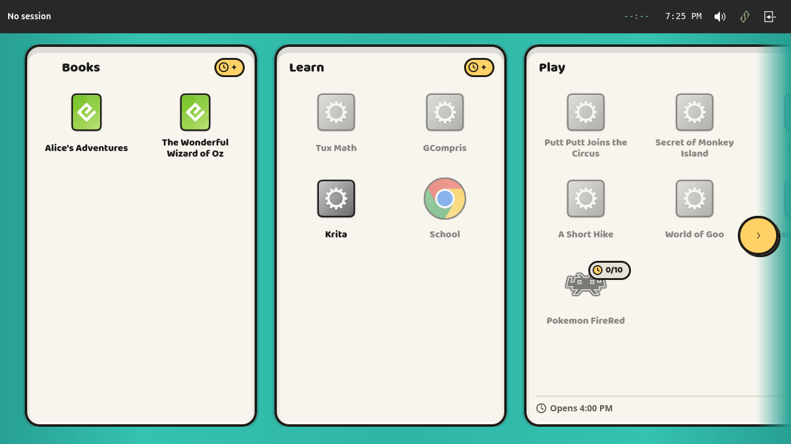
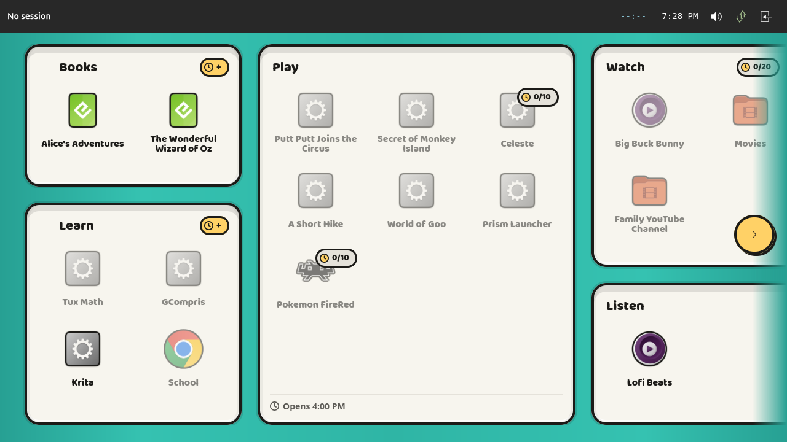
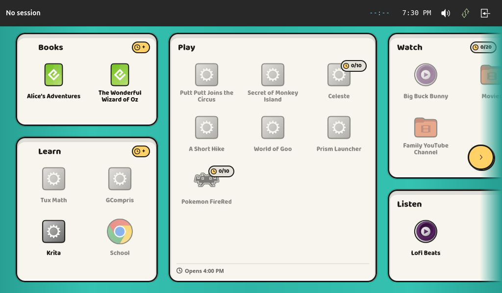

# The relayout that never ran (#208)

Two bugs reported as fixed in the sixth review round of
<https://github.com/aarmea/lunchbox/issues/207>, both still happening on the
device after <https://github.com/aarmea/lunchbox/pull/208> merged.

## The prompt

> following up on #208, I'm still seeing compartments start out at full height
> on boot, and also the inertial scroll/arrow interaction bug I pointed out

Both were addressed in `2026-09-19 004 launcher-branding (#207).md`, under
"Review, sixth round" — "The first frame was laid out for a screen nobody had
measured" and "Two things driving one adjustment". Neither fix did anything.
This note is about why, because in both cases the reason is the same shape: the
fix was put somewhere that never runs.

## The one that matters: `size_allocate` was never called

`LauncherField` overrode `WidgetImpl::size_allocate` to notice when the room it
has changes and lay itself out again. It also set a `GtkBinLayout` as its
layout manager, in `constructed`, and has done since the field was written.

**A widget that has a layout manager never has its `size_allocate` called.**
`gtk_widget_allocate` hands the allocation to the manager *instead of* invoking
the vfunc. The override was dead code from the moment it was written, and
nothing said so: it compiled, it read correctly, and the review round it
shipped in reported the bug fixed.

Confirmed rather than deduced — a `tracing::debug!` on the first line of
`size_allocate`, booted through the headless session, and `grep -c` on the
compositor log: **zero**.

There is nothing to use in its place. GTK4 has no `size-allocate` signal, and a
widget has no `width`/`height` property to watch; the allocation goes to the
layout manager or to that vfunc and nowhere else. So the field gave up its
`GtkBinLayout` and lays its own children out — fifteen lines that do what the
bin layout did, every child allocated the whole box, purely to be told the size.
The gotcha is now in the crate `README.md` under "Scaling", because it will
apply to the next widget here that cares what size it is.

## What the child actually saw

With the vfunc dead, the layout the field first built was whatever it had when
the daemon's first snapshot arrived — and a snapshot can easily beat the
compositor's first configure, because the launcher is fullscreen on an output
whose size it only learns after it is mapped. Laid out against a field of no
height at all, `compartment::budget` returns a room of zero, nothing pairs, and
every category takes a column of its own stretched to the full height of a
screen nobody has measured.



That is the report, exactly: "compartments start out at full height". Two books
in a tin the height of the screen. And nothing corrected it — the only thing
that ever had was the *next* snapshot from the daemon, which is where "then
after a few seconds the compacted layout appears" came from.



Books above Learn in one column, Play in its own, Watch above Listen — the
first thing drawn, and the only thing drawn.

### Reproducing it

It does not happen on a development machine, which is why the sixth round
believed its own fix. Here the window is mapped and allocated about ten
milliseconds before lunchboxd answers, so the field always has a size by the
time the state arrives. Two temporary patches to `app.rs` turn the race around,
and both are worth keeping in mind for anything else about the first frame:

* Delay `window.present()` by 400 ms.
* `stack.set_visible_child_name("loading")` before the window takes the stack.
  The field is the first page added, which makes it the stack's initial visible
  child, which is why it gets allocated in the very first layout pass whatever
  else is going on. A `GtkStack` allocates only the visible child, so starting
  on another page is what leaves the field genuinely unmeasured.

With those in, `RUST_LOG=lunchbox_launcher=debug` and the `laying the field out`
line say it plainly:

```
laying the field out height=0 ... heights=[207, 347, 526, 347, 207] slots=5
```

Five slots for five categories, against a height of nothing.

### And a belt as well as braces

Even with the vfunc live, the first build is one frame of a layout worked out
for a screen of no size, presented and then replaced. `rebuild` now refuses it:
if the field has not been given a width and a height, the snapshot is held —
`last_state` already has it — and a `pending_layout` flag has the next
allocation build it. Showing nothing for a frame is honest; showing the wrong
shape is not.

The flag matters on its own, not just as a companion to the size check. A field
handed a snapshot while it was hidden comes back to the *same* size it was
allocated before, and a size that has not changed would otherwise be taken as a
layout that is still good.

The guard in `compartment::budget` stays, with its comment corrected: it used to
say the zero-height answer was "the value for one frame at most", which had
quietly stopped being true.

## The stylesheet was built for a window of 0x0

Found while watching the boot, and the same shape of bug again.

`App::track_scale` watched the window's `default-width` and `default-height`
and, because those can still be the pre-fullscreen default at map time, also
asked once from an idle after `map`. Both are wrong. `default-width` and
`default-height` are what the window would be if it were *not* fullscreen, so
they never follow the screen and never notify; and the idle after `map` is a
race, which on the run above it lost:

```
Laying the field out for the output width=0 height=0 scale=1.0
```

That is the only time it ever fired. With nothing left to notify it, the
stylesheet stayed built for a window of no size for the rest of the session.
On a 1280x720 output that is invisible, because the scale for 0x0 and the scale
for 1280x672 are both 1.0 — which is why it survived every screenshot taken so
far.

The compositor's size arrives on the **surface**, which has `width` and `height`
properties that do notify. `track_scale` now hangs on those from
`connect_realize`, and reads the size off the window so the value is the one the
widgets are laid out in. Docking to another display (issue #87) comes through
the same notification.

The two fixes together are what makes an output change work at all. Before
this, moving the headless output to 1024x600 left the launcher rendering its
1280 layout and being cropped by the compositor; now it re-lays out and fits:



## The chevrons never cancelled a coast

The second report:

> if you tap the scroll arrows while an inertial scroll is going, the field
> scrolls in response to the arrow but then restores to where the inertial
> scroll would have gone afterwards resulting in flicker

The sixth round found the cause correctly — the field's own eased scroll and
GTK's kinetic deceleration both driving `hadjustment`, and the one with the
longer run winning — and wrote `stop_kinetic`, which cancels a deceleration in
flight by turning `kinetic-scrolling` off and straight back on.

It then called it from `scroll_to`, which is the *selection* path:
`scroll_to_cursor` bringing the focused item into view. The chevron chips do not
go through it. They call `nudge`, which calls `animate_scroll_to` directly — and
so does the D-pad running off the end of the row. The one path a child can take
while the row is still coasting was the one path that did not cancel it.

`stop_kinetic` now sits at the top of `animate_scroll_to`, which is the single
place every eased scroll passes through, so no caller can forget it. Before the
early return for a target that is already where the row is, too: the press has
replaced the coast whether or not it moves anything.

**Not verified on screen.** A kinetic scroll needs a touch drag, and the
headless seat has no touch device — `zwlr_virtual_pointer_v1` gives a pointer,
which GTK does not decelerate. This one is a reading of the call graph and
wants the device.

## What this cost, and the lesson

Three of the four fixes in this note are corrections to fixes, and all three
failed the same way: the code was right and it was in a place that never
executed. A dead vfunc, a `notify` on a property that never changes, a helper
called from the one path that did not need it. None of them fails a build, none
of them fails a test, and each was reported as done.

The sixth round's note says of an earlier one of these, "prose does not fail a
build". Neither does an override GTK has stopped calling. The cheap check that
would have caught all three is the one that caught them this time: put a log
line in the thing you just fixed, boot it, and count.
