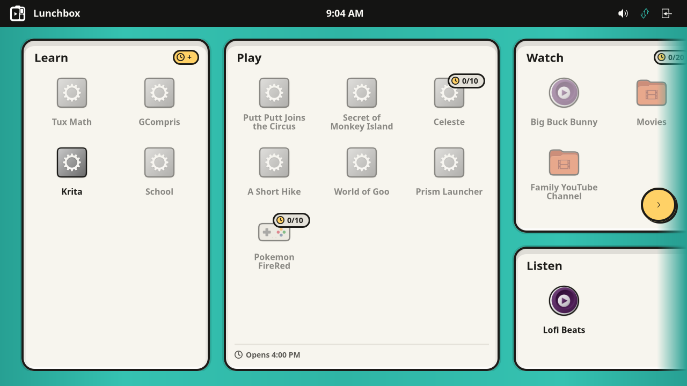
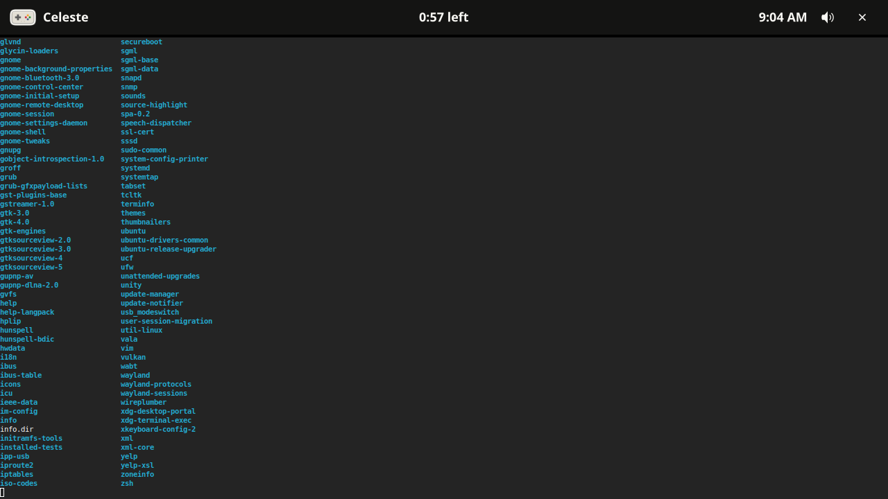
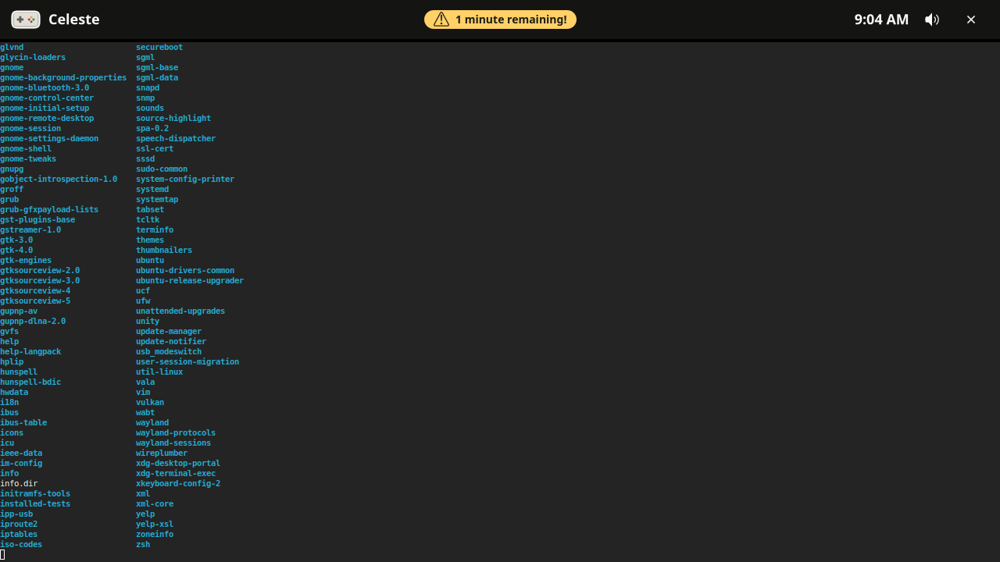
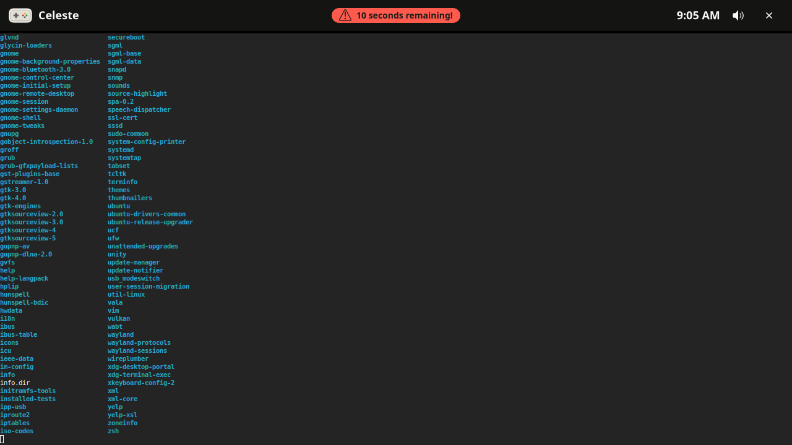
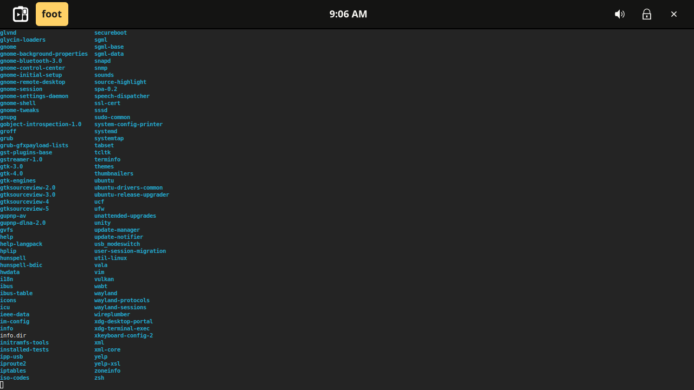
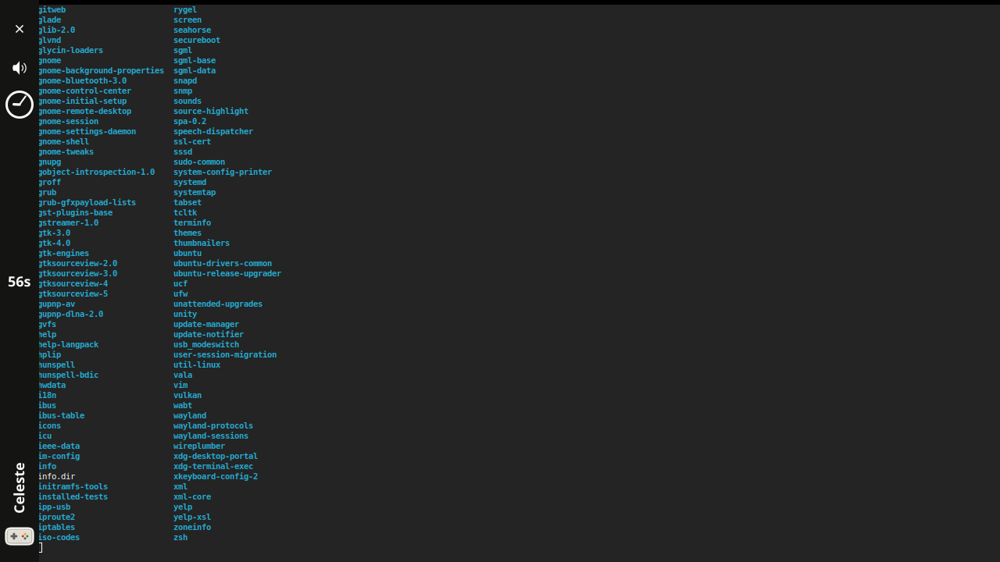
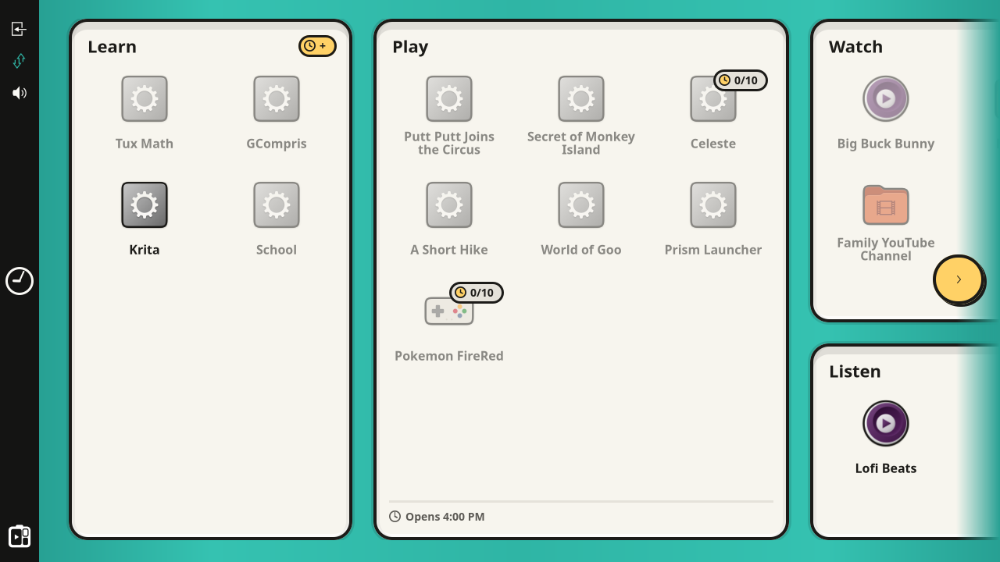
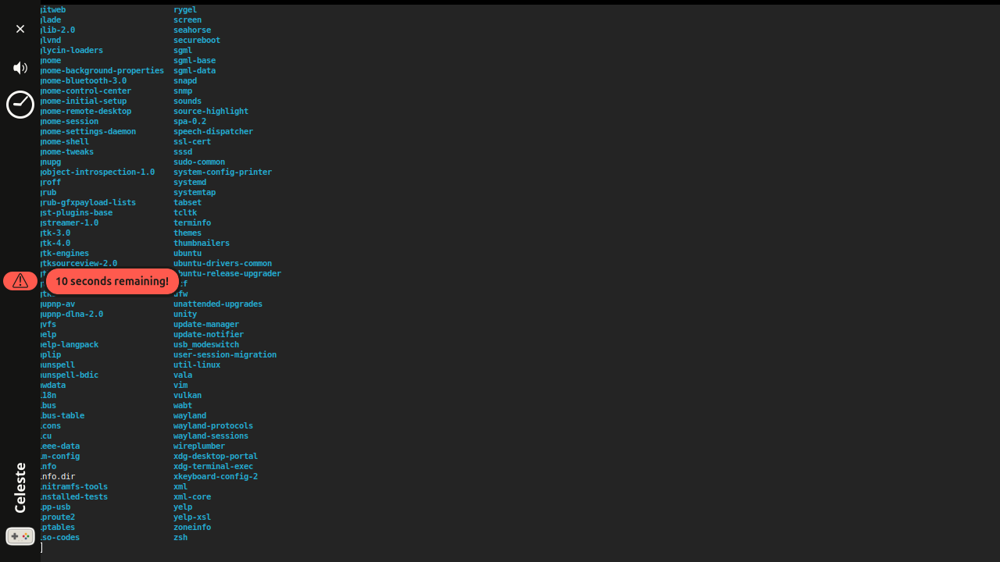
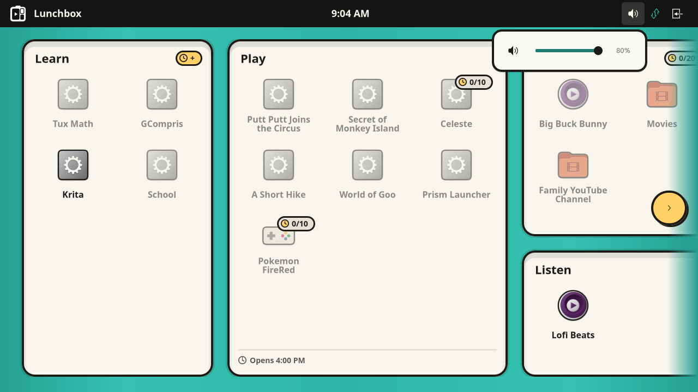

# HUD branding (#209)

Putting the HUD on the "enamel tin" branding the launcher has worn since #207,
so a device stops showing a branded field under an unbranded bar.

## Scope, as agreed before building

The issue ends by saying the undesigned half has to be settled before any code,
the way #207 settled its scope up front: the brief sketches seven things on this
bar and the bar carries about twenty, in two orientations, at arbitrary scale.
Four decisions were put to the author, and all four taken as recommended.

1. **The jar pill is a follow-up, not this issue.** This delivers the palette,
   Baloo 2, the mark, the wordmark, the keylined app icon, the countdown's
   wording and the warning toast. The pill showing the balance a session is
   spending, the filling jar during a source activity and the "Celeste is ready"
   toast need state the HUD does not subscribe to and belong with #8. Issue #215.
2. **56px, both orientations** — the design's `space.hud-h`, and a real
   behaviour change, because the thickness is the bar's layer-shell exclusive
   zone. Taken back to 48 once it could be looked at; see below.
3. **The warning becomes a toast**, as the brief draws it, rather than the
   persistent banner it was.
4. **The undesigned twenty keep their positions and their glyphs** and take the
   palette, the type and the chip. Not a redesign — there was nothing to
   redesign *from*.

## What it looks like

Every shot is the whole 1280x720 output rather than a crop of the bar, so the
48px it reserves can be judged against what is under it.

`config.example.toml`, with the management API switched off so the pairing
overlay is out of the way. The bar is ink, 48px, cream Baloo 2 at 18/700:
`[mark] Lunchbox` at one end, the controls at the other, and the clock in the
middle. The middle holds one thing at a time — a warning, else the countdown,
else the clock — so the clock moves out to the end the moment either of the
others needs the space. Most activities wear the icon theme's generic fallback
because Steam, RetroArch and the rest are not installed here.

The mark is `icon/lunchbox-mono-white.svg`, one of a set committed with #207 and
until now entirely unreferenced: one colour, with its compartments knocked out in
the bar's own `color.hud`, so it reads as a silhouette with holes rather than a
sticker laid on the bar. The colour mark the brief names is what it wore first —
at this size its four colours come to a few dozen pixels each and read as a
smudge. It is drawn at the activity icon's size rather than §8's 26px, and it is
the *idle* bar's: in an activity the activity's own icon takes its place.

In an activity, over a real window: the activity's icon at 34px under a cream
keyline and its name at the left, the countdown in the middle. The fixture is a
terminal called "Celeste" wearing the theme's `applications-games`, because
nothing in the example config runs on this machine and a real window is what
shows how much room the bar takes.

A warning **stands where the countdown stands** rather than beside it, for ten
seconds, and then the time is back. A warning is the only thing on this bar more
important than how long is left, and that is how it says so.

The same at `severity = "critical"`: red, blinking, and the countdown behind it
keeps that red once the pill has gone. The pill and the countdown are told how
loud to be by one mapping (`theme::Urgency`) rather than deciding separately.

Administrator mode's taskbar (#154), where the mark is the home button — a
shell's home button is the thing the shell is called. It said "Apps" in words
before, the one label here a caregiver had to read rather than recognise. The
lock at the right appears only in this mode. This layout could not be looked at
from a development session until this branch added a debug hook for it.

The same bar rotated (`LUNCHBOX_HUD_ANCHOR=left`, issue #171), read bottom-up
because the vertical bar is the horizontal one reversed: keylined icon and
rotated name at the bottom, `57s` in the middle, then the clock face, volume and
the way out at the top. The centre is the centre in both layouts.

Idle, where this bar carries the mark and nothing else — a word does not fit
across a bar on its side, and one read sideways is worse than none.

A warning here cannot fit in the bar at all, because the message is
operator-authored prose of no fixed length, so the bar keeps the pill and the
words drop out of it as a popover over the activity.

A flyout (#178): a cream panel with an ink keyline, standing 8px off the bar.
None of the popovers has GTK's arrow — one here drops from the control that
opened it and has nowhere else it could have come from, and the wedge is the one
part of a panel a keyline cannot follow.

## Where this departs from the design

**The bar is 48px, not the 56 the hand-off drew.** The thickness is the
layer-shell exclusive zone, so those 8px come off every activity on the device;
looked at on a real screen over a real window, the bar read no better for them.
What the 56 bought was margin around 18px type and a 34px keylined icon, and both
fit at 48 with the 4px of bar padding this bar had before the branding. The token
is 48 now, with its description saying where it came from.

The rendered bar is 50px in both orientations, measured: 32px of button, its own
4px of padding, the bar's 4px, and 1px of theme border each side. It overhangs
its zone by 2px, which it has always done — at 6px padding it rendered 54 against
the same 48px zone.

**The palette had no red, and now it has exactly one.** Yellow is spent on "you
can" rather than on danger, so a critical warning was putty that blinks, which is
what the brief asks for ("putty-on-ink when critical"). That did not survive
being looked at: running out of time is the one thing on this bar that has to
shout. `color.alert` (`#FF5A4E`) went into `tokens.json` — the first thing in
that file the design canvas did not hand down — picked on contrast rather than by
eye, at 5.99:1 as type on the bar and 5.60:1 for ink set on it, so one colour
serves both the countdown and the toast's fill and a critical pill still carries
ink like every other pill in the product.

Nothing else is red, and `red_means_a_critical_warning_and_nothing_else` says so
by reading the resolved stylesheet rule by rule. The end-session "X" is cream
like every other control — a child's way out of an activity is not an alarm, and
what guards it is the confirmation (#78) — and offline is putty, "not yet" rather
than "now".

**There is no "No session" chip.** §8 puts one beside the wordmark. A bar reading
`[mark] Lunchbox` over the launcher's own field is already a device with nothing
running, and a label saying so is a caption on a picture of itself. What the chip
was really fixing is that "No session" used to sit in the *title's* place, where
it read as the name of an activity; the title is simply empty now.

**The bar is `color.hud`, not `color.ink`.** The token file calls one the
in-activity bar and the other the outline every shape is drawn with, and they
differ by three values of luminance — nothing at all across a bar this thin. The
issue's own table asked for "Ink `#141413`", which is the name of one and the
value of the other; this is the way out of that ambiguity.

## What was built

| File | What changed |
| --- | --- |
| `assets/branding/tokens.json` | One colour the hand-off did not have (`color.alert`), and one size taken back off it (`space.hud-h`, 56 → 48). |
| `crates/lunchbox-branding` | **New.** The token codegen, moved out of the launcher, plus the mark and the two text passes a stylesheet needs. |
| `crates/lunchbox-widgets/src/icon.rs` | **New.** `IconArt` and `resolve_icon`, moved out of the launcher. |
| `crates/lunchbox-hud/src/theme.rs` | **New.** The stylesheet, moved out of `app.rs` and rewritten in tokens. |
| `crates/lunchbox-hud/src/app.rs` | The mark, the wordmark, the app icon, the centred middle, the toast's timer, a debug hook for administrator mode. |
| `crates/lunchbox-hud/src/time_display.rs` | "12:40 left", and nothing at all when there is nothing to count. |
| `crates/lunchbox-hud/src/state.rs` | Keeps the snapshot's entries, so the session's icon can be looked up. |

### The token crate, and why the HUD did not copy `theme.rs`

`tokens.json` had one consumer and its codegen lived inside it:
`lunchbox-launcher-ui/build.rs` wrote a `tokens` module for `theme.rs` to
include, with a **hand-maintained list** of which tokens became typed constants.
A second consumer would have had to copy the build script or come back and add
its tokens to the launcher's list.

So the codegen moved to a crate of its own and the list went away: every token
now gets a constant named after its own key (`space.hud-h` → `SPACE_HUD_H`,
`color.ink` → `COLOR_INK` and `COLOR_INK_RGB`). Two text passes moved with it —
`resolve_tokens`, which was the launcher's, and `scale_px_literals`, which
existed in **both** crates already in two spellings of the same twenty lines.

The HUD's stylesheet needed two things the launcher's never did, both now the
general case: a colour as bare rgba components, because CSS cannot make a
translucent wash out of `#rrggbb` and a hover state is exactly that; and
`@keyframes` surviving the substitution pass, which it did not — `resolve_tokens`
read the `@` as a placeholder and swallowed the stylesheet from there to the next
real token.

### Two tests that hold the line in both directions

`no_placeholder_survives` is the launcher's idea: GTK drops an unparseable rule
without a word, so a stray `@name@` would be a missing style in a screenshot
rather than an error anywhere. Its opposite is new here:
`no_colour_is_written_by_hand` walks every `#rrggbb` in the resolved stylesheet
and fails on one the token file does not define. A hex typed straight into a rule
resolves fine and looks fine, and is exactly the second copy this arrangement
exists to prevent.

## What the screenshots found

Five things, none of which a test would have caught:

* **The countdown had a second opinion.** The toast is transient, so the
  countdown is the only lasting sign a warning happened — and it read its colour
  off two hardcoded thresholds (yellow at five minutes, critical at one) rather
  than off the warning. Those are the numbers `config.example.toml` warns at, and
  both bands are inclusive, so the two crossed on the same tick in opposite
  directions: a *yellow* "1 minute remaining!" toast over a countdown that had
  just gone to the critical style. Three severities and two appearances now meet
  in one place, `theme::Urgency`, and the countdown is told how loud to be. It
  follows that an activity with **no** warnings configured counts down in cream
  to the end: the bar says what the policy says.
* **The countdown was rendering three hundred pixels from the name**, hard
  against the clock, because #160 gave the title `hexpand` to stop it collapsing
  to an ellipsis and an expanding label stretches across everything packed after
  it. It went next to the name, then to the middle of the bar, which needed a
  `CenterBox`: a box shares spare width between the children that claim it, so a
  "centred" child sits half the difference between the two side groups away from
  the real centre and drifts as the name grows.
* **An ink keyline on an ink bar is not a keyline.** The brief says "[app icon
  34 px, keyline]" and the launcher's is ink, which is invisible on `#141413`.
  `IconArt` draws it in `Widget::color()` now, read back from CSS, which is that
  crate's standing convention and leaves the launcher unchanged in effect.
* **The mark was rendering at 16px** — GTK's default icon size — while every
  comment and both READMEs said 26. A `GtkImage` draws what it holds at its icon
  size and centres it in whatever the widget was allocated, so `set_size_request`
  made the widget bigger and left the mark alone. It wants `set_pixel_size`.
* **The volume slider was wearing Ubuntu's orange.** Setting `background-color`
  on the highlight is not enough: the theme draws its accent as a 1px *border*
  around that node, so four pixels of enamel came with a `#E95420` hairline above
  and below. `border`, `box-shadow` and `background-image` all have to go.

And one that only a HiDPI panel shows, found by being asked whether any of this
had been tested at other scale factors — it had not. **The wordmark came back at
twice its size** after an `xwayland_native_resolution` activity. That is issue
#118's trap: GTK validates a widget's style when it is *mapped* and leaves it
alone while it is not, so a widget that sits out a `HudScaleChanged` returns
wearing the previous factor's sizes. The wordmark is the idle bar's, so it is
hidden for exactly the span of the activity that changes the factor. A factor
change now rebuilds the bar, the way an orientation change already did and for
the same reason.

And one about the tools rather than the bar: **hover states are always on under
the headless seat** for whatever a popover grabbed, so every screenshot of the
confirmation prompt is a screenshot of a hover state. That is how cream on
`color.enamel` at 2.41:1 came to be the only resting colour ever photographed for
"End activity"; it darkens to ink now. Both that and "sample pixels rather than
squinting at a 4x crop" are in the `headless-dev` skill.

## Verified on screen

Everything above is a real frame from `lunchbox dev headless`, at compositor
scale 1.0. The XWayland counter-scale (issue #45) was then exercised on its own,
by setting `output HEADLESS-1 scale` and launching an entry with
`xwayland_native_resolution = true` so lunchboxd drops the compositor to 1.0 and
broadcasts the captured factor:

| Compositor | HUD factor | Bar, in physical pixels |
| --- | --- | --- |
| 2.0 | 1.0 | 100 |
| 1.0 | 2.0 | 98 |
| 1.5 | 1.0 | 75 |
| 1.0 | 1.5 | 74 |

The bar keeps its physical size across the swap, which is the whole point of the
counter-scale. The two-pixel shortfall is the GTK theme's own 1px button border
on each side, which is in logical pixels and does not counter-scale; it is the
same 2px overhang the bar has at every factor.

Also checked and not pictured:

* the launcher's own keylines, after `IconArt` moved crates and changed where its
  colour comes from — identical to before;
* the bar at 800x600 with the page-turn buttons, with a short name and with
  "Alice's Adventures in Wonderland, Illustrated";
* the vertical bar during an activity, which is the layout most likely to break
  when things are added to the left-hand group.

## Out of scope, and still open

* **The jar pill and everything behind it** (issue #215): the balance this
  session is spending, the filling jar during a source activity, the "Celeste is
  ready" toast. The HUD has no concept of token gates; `EntryView::tokens`,
  `GroupView::tokens` and `earns_tokens` are on the snapshot, and as of this work
  the HUD keeps the snapshot's entries, so the data is in reach.
* **Bedtime** (§9) stays with the launcher, and is blocked on
  `ReasonCode::OutsideTimeWindow::next_window_start`, which nothing computes yet.
