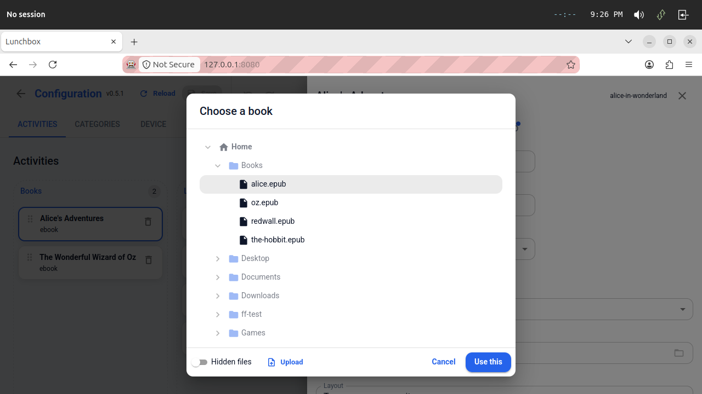
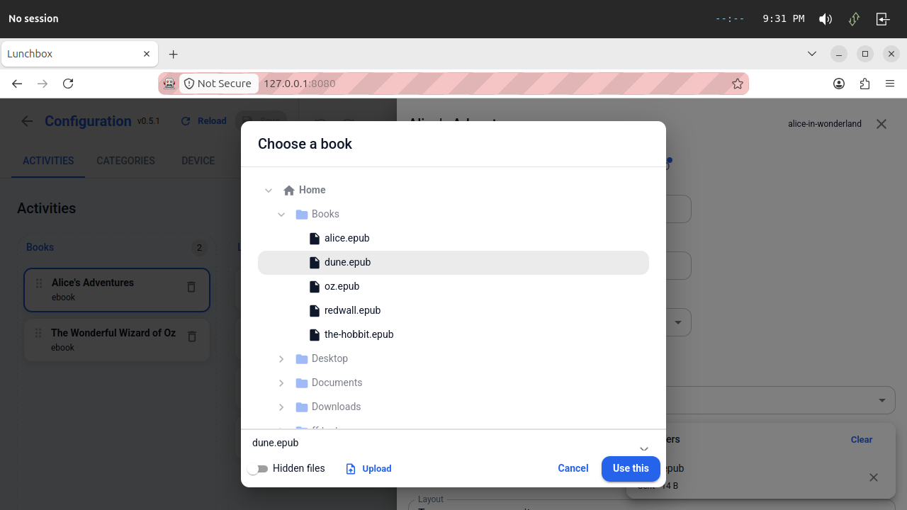
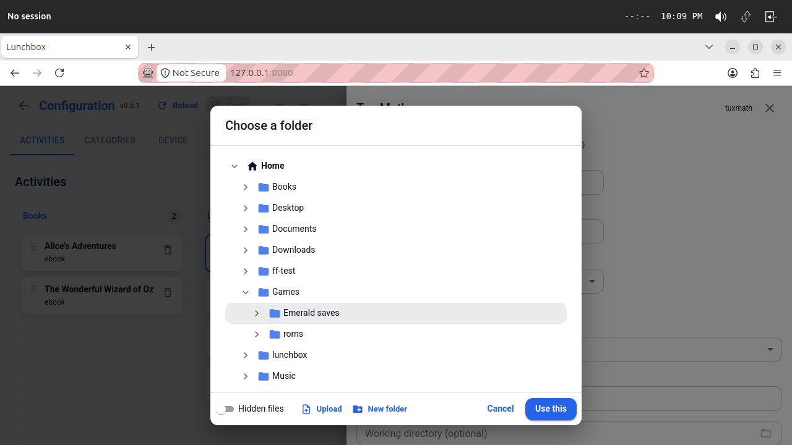

# The file picker, as built (#186)

**Date:** 2026-09-21
**Issue:** <https://github.com/aarmea/lunchbox/issues/186>
**Scope note:** `2026-09-21 004 config-editor-file-picker (#186).md`

## The prompt

> implement it

Following the investigation in note 004, which surveyed the fields, found the
back end already shipped with the remote file manager (#195), and answered the
follow-up question of whether a file could also be *uploaded* from inside the
editor. This is what got built, in four commits.

"Browse…" beside `book` opens on `~/Books/alice.epub` — Home and Books already
expanded, the file already selected — rather than at the roots with the person
to navigate back to where they started.

## What is where, and why it is there

The boundary decided the shape, exactly as note 004 expected:

| File | What it holds |
| --- | --- |
| `src/config/pick/FilePicker.tsx` | The interface, a context and a hook. Nothing else — this tree also builds into the standalone bundle. |
| `src/config/components/PathField.tsx` | `DraftTextField` plus a browse button, which is absent when no picker is in context. |
| `src/files/pick.ts` | The arithmetic: a picked row to a config path, a config path back to a place in the tree, and what may be picked. |
| `src/files/FilePickerDialog.tsx` | The tree as a question. |
| `src/sources/DeviceFilePicker.tsx` | The implementation, and the promise the dialog resolves. |

The first commit was mechanical on purpose: the five path fields became
`PathField` while nothing supplied a picker, so it changed no behaviour and a
reviewer never has to separate the rename from the feature.

**Five fields, not every path.** `content`, `book`, `library`, `cwd` and
`core_path`. The service directories and `extra_roots` are outside the
browsable tree by construction — the last circularly, since it is what defines
the tree — so a button there would open on nothing.

**`content` asks for "either".** A few libretro cores load a directory rather
than a file, which is why the device's own check is `exists` and not `is_file`.

## Three things that only look like details

**The home root is written `~/`.** The API speaks `(root id, path)` and never
takes an absolute path back, so something has to choose the spelling.
`~/` is right rather than merely equivalent: the home root *is* the `$HOME`
that a launch expands `~/` against, and a root's reported path has been
`canonicalize`d — so a home reached through a symlink would otherwise be
recorded as its target, a path that works and that nobody wrote.

**A name that is not text can never be the answer.** TOML is UTF-8, so a
`name_not_utf8` entry — which the file manager lists, and can rename — cannot
be named by any policy. It is dimmed, and selecting it says so under the
button, rather than being a row that silently ignores clicks.

**A transfer is not a file.** The device assembles an upload under
`.{name}.{token}.part` and publishes it with one atomic rename, and the listing
hides part files. So the picker will not offer an upload that is still in
flight; when a single file lands, it is selected, which makes the whole gesture
one move.

## Making the folder it goes in

Asked for right after the first round, and the same shape of problem as the
upload: the place a file belongs does not exist yet — a `Roms` folder beside
the books, somewhere for a game's save data. Leaving the editor for the Files
tab to make one and coming back is the round trip this picker exists to
remove.

It reuses the Files tab's `NewFolderDialog` — the illegal-name check and the
wording are already there — and aims at the same target the upload does. The
new folder is *selected*, not merely shown: for a field that wants a folder
that is the answer in one more press, and for one that wants a file it is
where the upload now aims.

The only new thing it needed was a way through the z-index: this dialog raises
itself above the transfer tray, so a plain modal opened from inside it would be
drawn underneath the thing that opened it. `NewFolderDialog` takes an `sx`, and
the picker hands it one step higher again.

## What the headless session found that the tests could not

The tray is fixed to the bottom-right corner at `theme.zIndex.snackbar`, which
is *above* a dialog — so it sat over "Use this", and on a phone, where the tray
is full width, it would cover the action row entirely. The fix is the dialog
above the tray, carrying the transfers it started itself with the tray's own
row: raising it alone would have hidden the "Replace?" question a name clash
stops to ask, which behind a modal is an upload that stalls for no reason.

## Verifying it end to end

The headless session, driven through Marionette (`headless-dev` skill, "Seeing
the web UI"). The whole loop:

1. Sign in, open **Config**, open an `ebook` activity.
2. "Browse…" beside **Book** → the dialog opens on `~/Books/alice.epub`.
3. Pick `the-hobbit.epub`, **Use this** → the field reads
   `~/Books/the-hobbit.epub`.
4. **Save**, then `GET /api/v1/config` → `book = "~/Books/the-hobbit.epub"`.
5. Reopen, **Upload** a file from the browsing computer → it appears in the
   tree, the transfer row says "Sent", and it is what is selected.
6. On a `process` activity's **Working directory**, **New folder** inside
   `Games` → `~/Games/Emerald saves` is created, selected, and **Use this**
   puts exactly that in the field.

One gotcha worth writing down: **`dev headless` boots
`./config.example.toml`, so pressing Save in the dev editor edits the file in
the repository.** It shows up as an ordinary working-tree change and is easy to
commit by accident. `git checkout config.example.toml` afterwards, or boot
`--config` against a fixture.

## Not done here

The issue's other two items — Steam activity autosuggestion and RetroArch
backend autodetection. Both need a new read-only enumeration from the daemon
(installed games; cores that can load a given ROM), and the second wants the
ROM this picker just chose, so it is the natural next piece of work.
