# The media app wears the tin (#224)

<https://github.com/aarmea/lunchbox/issues/224>

## The prompt

> implement #224

The issue, "Reskin the media app":

> This applies to both the Linux and Android builds -- the "design" roughly
> resembles the shepherd-era launcher from when it was built.
>
> Let's get it more in line with the current Lunchbox launcher.

and two comments from its author: three mockups ("reference only, pull them
from the below instead") with a later cut of the branding hand-off,
`lunchbox-branding.zip`; and

> This only tracks the changes to the media app -- the HUD as implemented
> (#209) has intentionally diverged from the original designs.

The zip adds a `MEDIA.md` brief, a `media.css` and three `reference/media-*.png`
mockups to the #207 hand-off. The brief is reproduced at the end of this note,
because it is the specification this was measured against and it is not
otherwise in the repository. The mockups are beside this note; unlike the
launcher's they contain no third-party art. `media.css`'s numbers are the
constants at the top of `lunchbox-media-ui`'s `library.rs` and `video.rs`.

## What it looks like

Every shot is `lunchbox-media` under `lunchbox dev headless` at 1920x1080
(compositor scale 1.5, so 1280x720 logical, the size the mockups were drawn at),
over a fixture library of ten generated test videos and posters. The first
title is "Big Buck Bunny" only because the mockups use it; the fixture's
thumbnails are ffmpeg test patterns. One item has no poster, to show the
placeholder; one title is long enough to wrap.

### Library

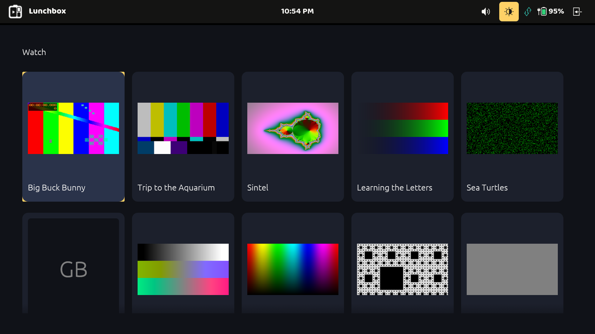

Before: the dark, vertically scrolling grid of portrait tiles the app was
built with, posters letterboxed into them, title in egui's bundled light face.

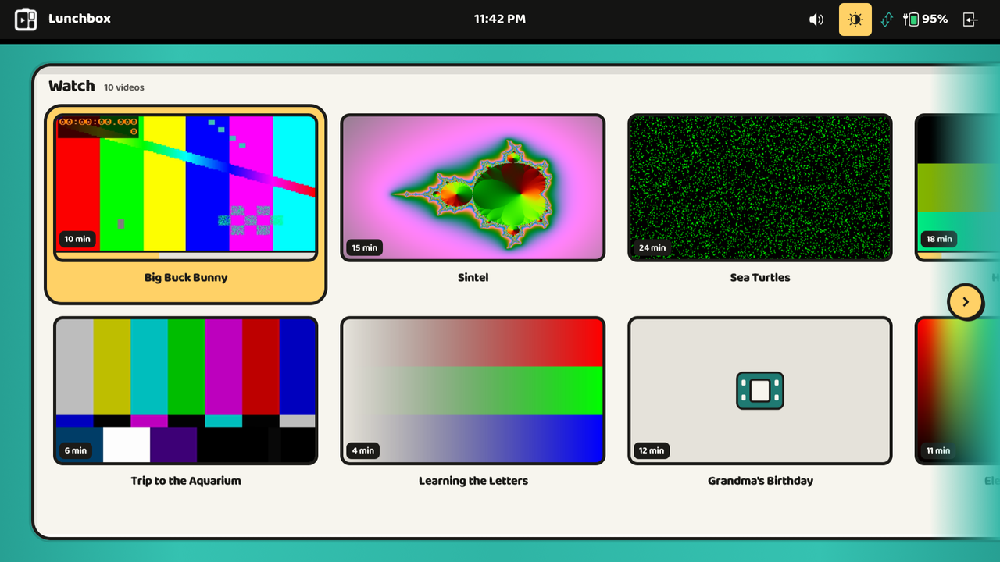

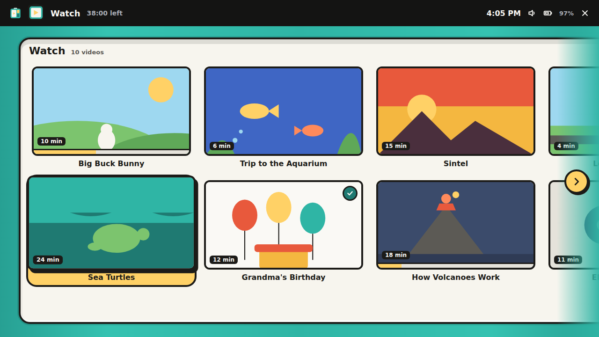

One sunk compartment on the enamel field, stretched to it: the library's name
and count, then 340x191 thumbnails in two rows that fill column by column and
spill to the right. The row scrolls sideways only; the fade and the yellow
chevron chip appear on whichever side has more, and the chip pages the row
when tapped. Thumbnails are cropped to fill (the old grid letterboxed them),
wear the duration chip, and draw the hand-off's video placeholder on putty
where there is no poster. Selection is the launcher's: yellow fill, 4px ink
outline, 18px corners.

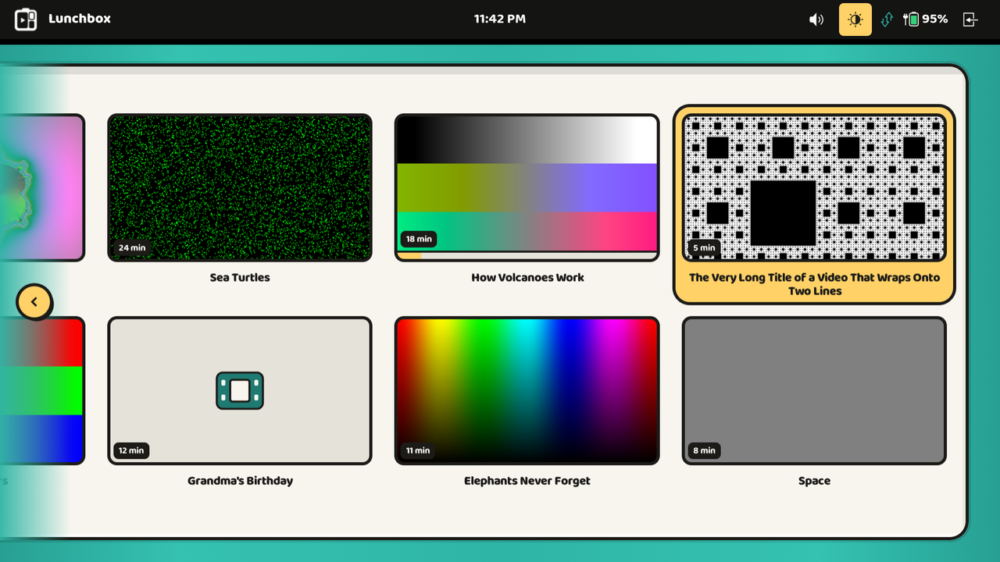

Scrolled to the end by the D-pad: the row stops a field margin in from the
right, the cue has moved to the left edge, a two-line title wraps, and the
started-but-not-finished item ("How Volcanoes Work") carries its progress
strip.

### Resume state

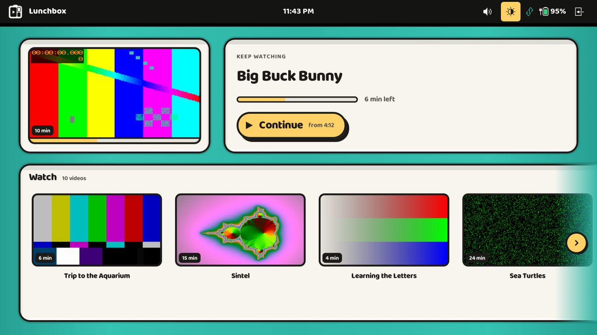

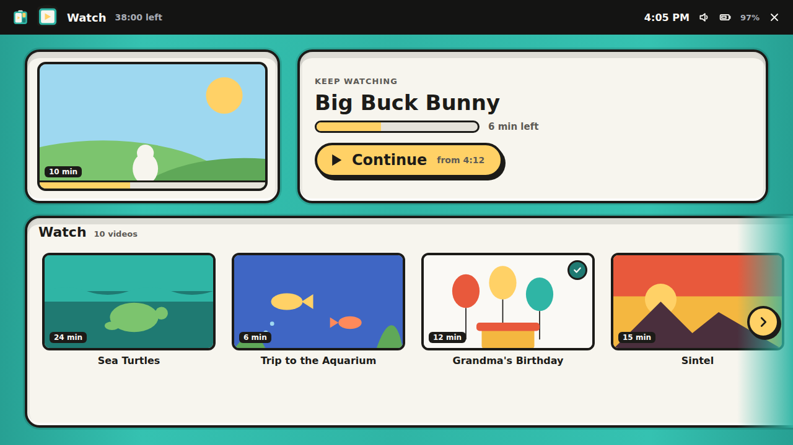

With `--resume` on and the last item left partway through, the library opens
with the "keep watching" row above a one-row library that leaves that item
out. Continue has the focus: lifted 2px on a deeper shadow. Down goes into the
library; up from its row comes back.

This replaces the modal "Continue watching" card, which had its own Resume and
Library buttons over a dimmed grid.

### Player

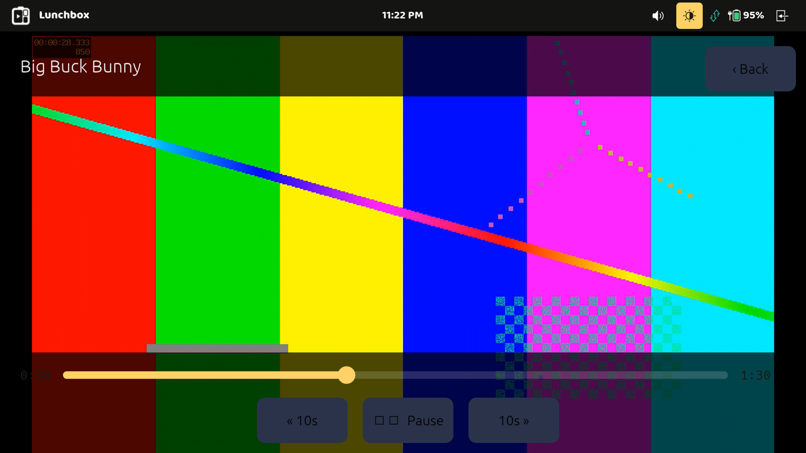

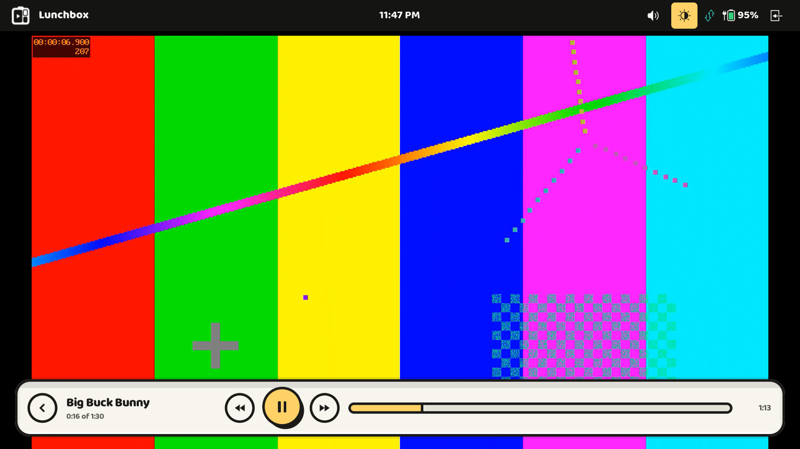

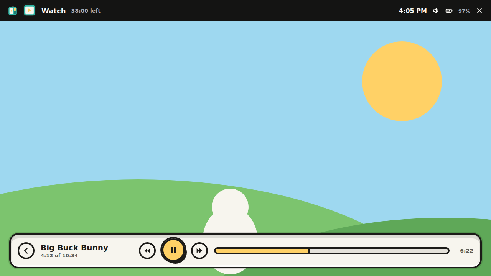

The two translucent black strips become one compartment floating at the
bottom of the picture: Back, the title and where playback is, −10s, the 60px
yellow play/pause drawn selected, +10s, the seek track and the time left.

### Android

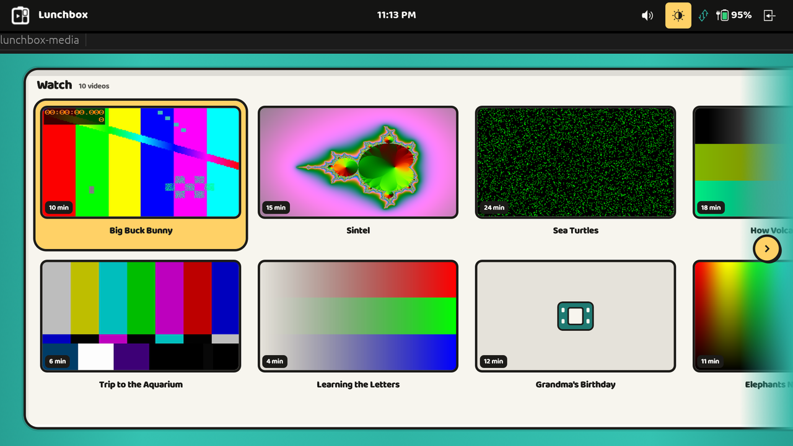

The Android app draws the same `LibraryView`, here in its `desktop_preview`
example on the host, under the app's own top bar (Android has no Lunchbox HUD,
and the bar is where it reports errors).

**On a phone.** A debug APK on a moto g power (1600x720 landscape, 280dpi),
over the same fixture served from the development machine on the LAN, with
the resume file seeded through `run-as`:

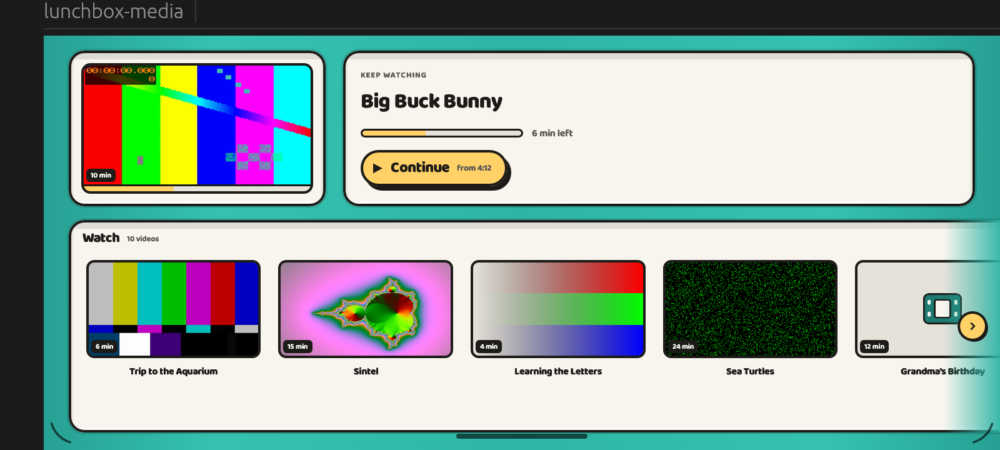

The field scales to about 0.84 of the design here, and sits inside the
display's safe area; the dark strip on the left is the camera cutout's inset,
which the app's own screens already kept clear of.

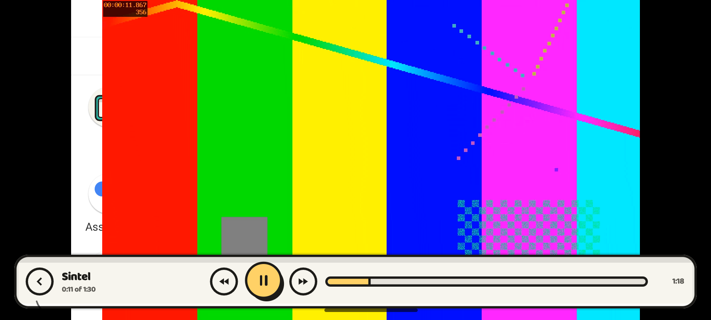

Playing, with MediaCodec zero-copy decode. Continuing, Back, and playing a
thumbnail all worked by touch, and the "keep watching" row was gone on
return, as intended.

That shot also shows a bug this change did not touch: **the picture is drawn
70px to the right of where the letterbox is painted**, so a strip of the home
screen shows at its left edge. The log says the surface was placed at
`1280x720+160+0`, and the picture lands at x=230; 70px is the cutout inset.
Placing the SurfaceView (`surface.rs`) seems to measure from inside the
inset while the egui overlay draws from the display's edge. It is not fixed
here; it is issue #225.

Two things about that fixture that cost time: `python3 -m http.server`
answers no range requests, so an MP4 whose index is at the end (ffmpeg's
default) fails to load with `Raw(-16)` — remux with `-movflags +faststart`;
and a saved position beyond a short test clip's end fails the same way.

## Decisions

**Where it lives.** The library screen, its theme and the player's controls
were already shared between the two front-ends in `lunchbox-media-ui`, so that
is where the reskin is. The binaries lost code: the grid's focus arithmetic
and the modal card's handling went with the views, and their gamepads now
translate into a four-way `Nav`.

**The tokens come from the design file.** `lunchbox-media-ui` depends on
`lunchbox-branding`, the crate the launcher and the HUD read `tokens.json`
through, rather than restating hex values. The sheen gradient is parsed from
its CSS token. The sunk-compartment shadow is a CSS recipe egui cannot take,
so it is drawn by hand in the order the launcher brief ranks its parts.

**Baloo 2 is compiled in.** egui cannot reach fontconfig and Android has
none, so the variable font from `assets/fonts` is `include_bytes!`'d — 683KB
in each binary. egui 0.34 renders variable fonts at a fixed set of axis
coordinates per registered face, so it is registered twice, at 800 and 700.
The brief sets secondary lines in the system sans at 600–700; egui's bundled
face is a light one that reads as another app beside Baloo 2, so those lines
are Baloo 2 at 700.

**It scales rather than reflowing.** Every length is in the mockups' pixels,
at their 1280x664 field, multiplied by a `Scale` fitted to the narrower axis —
the launcher's rule. On the Linux kiosk that is 1.0 at 1280x720 and 1.5 at
1080p. The library gets more rows when a tall screen has room for them (the
launcher does the same), and the player's controls do not go below 0.75, which
on a phone is what keeps them the size of a fingertip.

**The D-pad model moved with the layout.** A column-filled grid wants
left/right to cross columns and up/down to stay in one, the opposite of the
row-filled grid it replaces. That logic is in `library.rs`, with tests, rather
than in each binary.

**The "keep watching" row replaces the card, and is offered less.** The card
was offered for the last item watched even when it had been watched to the
end, with nothing to continue; the row is offered only for an item with a
saved position, which the shared resume policy keeps only for an item left
between 20 seconds in and 30 seconds from the end (the brief says 5–95%; the
existing policy was kept rather than having two). It goes as soon as anything
is played. It is not modal, so Back no longer dismisses anything: on Linux it
ends the session and on Android it goes back to the switcher, as from the
plain library.

**The remote still works the player the way it did.** The brief draws
play/pause as "the selected control" and describes the D-pad seeking "while
the track is focused", which implies a focus moving between the buttons. The
remote's left and right already seek and its centre already toggles; putting
a focus in between would cost a TV remote a press to reach the thing it
presses most. So play/pause is drawn selected and nothing else changed. The
controls stay up four seconds rather than three, as the brief has them.

## Verified

- `cargo test`, `cargo clippy --all-targets -- -D warnings` and `cargo fmt` over
  `lunchbox-media-ui`, `lunchbox-media`, `lunchbox-media-android` and
  `lunchbox-media-app`, at every commit. The new tests pin the D-pad model, the
  layout against the mockups' coordinates (first thumbnail at x=68, the second
  column at 436, the control bar 24/20 from the edges and 92 tall), the cover
  crop, the wording, and the tokens' conversion.
- `cargo ndk -t arm64-v8a build -p lunchbox-media-android` and the Gradle
  `assembleDebug`.
- Every screenshot above, driven through `wtype` in the headless session:
  moving across and down the grid, scrolling to the end and back, Down from
  Continue into the library and Up back.

Two things about the headless session cost time and are worth knowing:

- **A `Shift_L` from `wtype` closes the egui window**, and `lunchbox-media`
  then aborts in libmpv's destructor (exit 134, no Rust panic; the backtrace
  is `libmpv2::Mpv::drop` under eframe's `save_and_destroy`). The abort on
  teardown happens with the old UI too, and whenever a direct-play item ends.
  It is not this change's and is not fixed here.
- **The first press from a fresh `wtype` is often lost**, so a single `-k
  Right` may do nothing; the skill's advice to send several presses per
  invocation holds for this app as much as for the others.

## Not built

- **The watched check.** The resume state forgets an item watched to the end —
  that is its policy, so the next play starts over — so there is nothing to draw
  a "watched" disc from. Recording it needs a new field in the resume file,
  which both front-ends read, and a decision about what "watched" means for an
  item never resumed.
- **Focusing the neighbour when a video ends.** The session does not tell the
  UI whether playback stopped because it ended or because the viewer left, and
  the brief only wants the neighbour in the first case.
- **The 120ms press lift** before a thumbnail launches.
- **Ink letterboxing.** On Linux mpv paints its own black bars inside the frame
  it renders, and the Android app paints its bars to match, so both stay black.
- **The HUD contract (§6)**: reporting the current title to Lunchbox. The HUD
  shows the activity's name, as it did.
- **Android's own screens** — the switcher, settings, the add-library form —
  keep the TV theme. The brief covers only the library and the player.

## The brief

Reproduced verbatim from `branding/MEDIA.md` in the issue's
`lunchbox-branding.zip`. Its image links point at the zip's `reference/`
folder; the same three mockups are beside this note as `mockup-*.png`.

---

# Media app brief

For an agent implementing the standalone media app to the branding in this folder.
Read `README.md` for the language and `IMPLEMENTATION.md` for the launcher; this
file covers only what the media app adds. `tokens.json` and `launcher.css` still carry
the numbers; `media.css` adds the media-specific classes on top.

## 1. Scope

- The library screen (thumbnails and titles for the library Lunchbox passed in).
- The resume state of the library screen.
- The player.
- Out of scope: grouping, schedules, quotas and gates. Lunchbox does all of that and
  launches the app with one library; the app never shows time rules of its own. The
  in-activity HUD is Lunchbox's and sits above the app (56 px); the app renders below
  it and assumes it's there.

## 2. The one idea

The media app is the media icon at screen size: **one compartment**. The library is a
single sunk compartment on the enamel field, exactly the launcher's compartment
(`.lb-compartment`), holding thumbnails instead of app icons. No second compartment
unless something is half-watched (§4).

## 3. Library screen (default)

| Slot | Rule |
| --- | --- |
| Compartment | `.lb-compartment`, stretched to the field: left 40, top 24, bottom 28. It is wider than the screen when the library is; the row scrolls horizontally (`.lb-field__fade` + `.lb-field__more`), never vertically |
| Header | Library name (`groups.label` as passed by Lunchbox) 22/800, then "10 videos" 13/600 muted |
| Tiles | 16:9 thumbnail in a 4 px ink border, 12 px radius; title below, 16/800, centered, max 2 lines. Grid: 2 rows, column-flow, 340 × 191 thumbs, 10 × 12 gaps. Fewer than 6 videos: 1 row of 340-wide tiles (don't scale up) |
| Duration | Ink chip, cream text 12/700, bottom-left of the thumb: "10 min" |
| Progress | Only when partly watched: a putty strip on the thumb's bottom edge with a 3 px ink top rule and a yellow fill = fraction watched |
| Watched | A deep-teal disc with a cream check, top-right of the thumb. No progress strip |
| Thumbnail missing | `icon/placeholders/video.svg` centered on a putty tile, same border |

Selection and press are the launcher's: `.lb-item:focus-visible` (yellow fill, 4 px
ink outline, 18 px radius) and `data-pressed` (scale 1.12 → here 1.06 because the
tiles are large, rise 4 px, 5×6 ink shadow, 120 ms). D-pad: left/right across
columns, up/down within the two rows, no vertical wrap; hitting the right edge
nudges the scroll.

## 4. Resume state

When the app opens and the library contains a video with progress between 5 % and
95 %, open in the resume state: a hero row above a one-row library.

- Hero row: two compartments. Left: the thumbnail at 372 × 209 in a compartment with
  16 px padding. Right: "KEEP WATCHING" 13/700 uppercase muted, the title 34/800, a
  progress bar (14 px, 3 px ink border, putty track, yellow fill) with "6 min left",
  and the *Continue* button.
- *Continue* button: yellow pill, 4 px ink border, 4×5 ink offset shadow, 24/800,
  play glyph, "from 4:12" 14/700 muted. It is the initially focused control. Focus
  ring on it is the same yellow fill (already yellow) plus the lift; make it obvious
  by raising it 2 px and adding the shadow.
- The library below drops to one row (280 × 158 tiles) and excludes the hero video.
- If more than one video is resumable, the hero shows the most recently watched.
- Finishing the hero video or pressing Back from it returns to the default library.

## 5. Player

- Video full-bleed under the HUD, letterboxed on ink.
- Controls: one compartment (`.lb-compartment`) floating at the bottom, 24 px from
  the sides, 20 px from the bottom, 12 × 18 padding: **Back** (cream disc, 44 px),
  title 20/800 and "4:12 of 10:34" 13/600 muted in a 240 px column, **−10 s**, the
  **pause/play** disc (60 px, yellow, the selected control, 4 px ink + 5×6 shadow),
  **+10 s**, the progress track (18 px, 4 px ink border, putty, yellow fill with a
  4 px ink leading edge), remaining time 14/700 muted.
- Controls auto-hide after 4 s of no input while playing; any D-pad press brings them
  back with focus on pause/play. They never hide while paused.
- Left/right on the D-pad while the track is focused: seek 10 s. Holding: 30 s per
  second.
- When the video ends: return to the library with that tile marked watched and its
  neighbor focused. No autoplay-next; Lunchbox's time rules make autoplay a bad idea
  for a kid.
- When Lunchbox ends the session it closes the app; the app persists progress on
  every pause, seek and every 10 s of playback so nothing is lost.

## 6. HUD contract

The app doesn't draw the HUD, but the HUD shows: the Lunchbox mark, the media icon
(`icon/apps/media-small.svg` at 34 px with the ink keyline), the library name, and
time left. The app should report the current title to Lunchbox if the HUD is to
show it; in the mockups it shows the library name.

## 7. Acceptance checklist

- [ ] Library is one compartment on the enamel field, sunk, no drop shadow.
- [ ] Thumbnails have the 4 px ink border; titles 16/800 under them; nothing under 12 px.
- [ ] Horizontal scroll only; fade + chevron only on overflow.
- [ ] Progress strip and watched check appear per §3; never both.
- [ ] Resume state appears only with a resumable video; Continue is focused first.
- [ ] Player controls are a single compartment; pause/play is yellow and 60 px.
- [ ] Ending a video returns to the library; nothing autoplays.
- [ ] Screenshots at 1280×720 match `reference/media-*.png` in structure.
