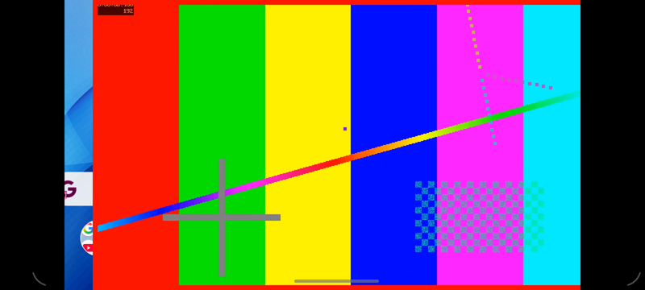
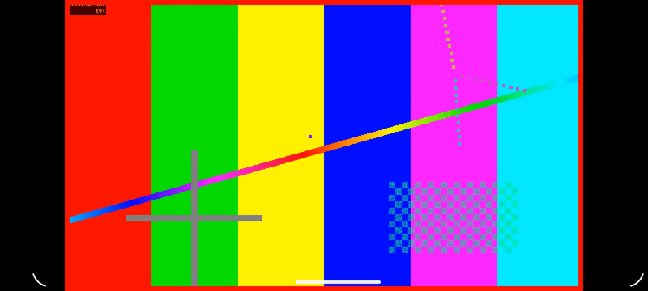

# The video was placed from the wrong origin (#225)

The prompt was "fix #225 -- you have two phones to test against, both with
cutouts". The issue:

> On a phone with a camera cutout, the Android media app draws the video 70px
> to the right of where it paints the letterbox. […] The 70px difference
> matches the display's left safe inset (the cutout) […] The SurfaceView that
> rect is applied to over JNI seems to be positioned inside a parent that has
> already been offset by the cutout inset.

## What was actually wrong

The issue's guess was right, and the view hierarchy on the moto g power
(Android 11) shows it directly (`dumpsys activity top`):

```
DecorView[LunchboxMediaActivity]
  LinearLayout            0,0-1600,678
    FrameLayout           70,0-1600,678   android:id/content
      SurfaceView         160,0-1440,720
```

`Theme.NoTitleBar.Fullscreen`'s decor layout is a `LinearLayout` that fits
system windows. The window goes under the cutout (`shortEdges`), but that
layout still pads `android:id/content` by the cutout (70px left) and the
gesture bar (42px bottom). The SurfaceView lived in `content`, so its margins
were measured from x=70, while the native renderer paints the bars from the
window's own edge. The frame was also taller than its parent.

The Pixel 10a (Android 16) never showed it. With targetSdk 35, Android 15+
enforces edge-to-edge, so the content frame is not padded and the two origins
happen to agree. That is also why it looked like a moto-only bug.

## The fix

Attach the SurfaceView to the decor view instead of `android:id/content`. The
decor view is the one view guaranteed to span the window, which is the frame
`setVideoBounds`' rectangle is already in. This is better than the issue's
other two ideas:

- Adding the inset in Java would mean the view hierarchy's padding and Rust's
  geometry have to agree forever. Also, `content` is 42px short at the bottom,
  so the frame would still hang out of its parent.
- `LAYOUT_IN_DISPLAY_CUTOUT_MODE_*` is already `shortEdges`. The window was
  never the problem, only the padded frame inside it.

## Verification

Both phones on USB, playing a red-bordered 1280x720 and a 720x1280 test
pattern. The red border's extent was measured in `screencap` against the
logged `video surface placed at` rectangle:

| Phone | Clip | Placed at | Red border, x | y |
| --- | --- | --- | --- | --- |
| moto g power, before | 16:9 | 1280x720+160+0 | picture at ~230–1510 | — |
| moto g power | 16:9 | 1280x720+160+0 | 160–1439 | 0–719 |
| moto g power | 9:16 | 405x720+597+0 | 597–1001 | 0–719 |
| Pixel 10a | 16:9 | 1920x1080+252+0 | 252–2171 | 0–1079 |
| Pixel 10a | 9:16 | 608x1080+908+0 | 908–1515 | 0–1079 |





## Bench notes

- **No LAN server needed for a test library.** Serve the fixture on the dev box
  with `python3 -m http.server 8765 --bind 127.0.0.1`, run `adb reverse
  tcp:8765 tcp:8765` per phone, and point both `settings.toml` and the library
  TOML's `uri`s at `http://127.0.0.1:8765/`. `settings.toml` goes in through
  `run-as com.lunchboxos.media` (copy it from `/data/local/tmp`).
- **A debug APK from another machine is signed with another debug key.** The
  phones had #224's builds, so `install -r` failed with
  `INSTALL_FAILED_UPDATE_INCOMPATIBLE`. `run-as … tar cf -` backs up the app's
  data before the uninstall.
- **Check `mCurrentFocus` before tapping by coordinates.** After `install -r`,
  the Pixel's `PackageUpdateActivity` starts the activity a second time. The
  native side then logs `eframe exited with error: winit EventLoopError:
  EventLoop can't be recreated` and the app vanishes, so taps meant for it
  landed on the companion app. This is a pre-existing limitation of starting
  the activity twice in one process, not something this change touched.
